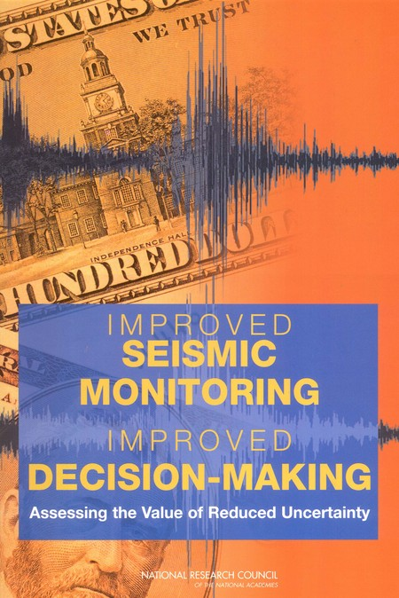
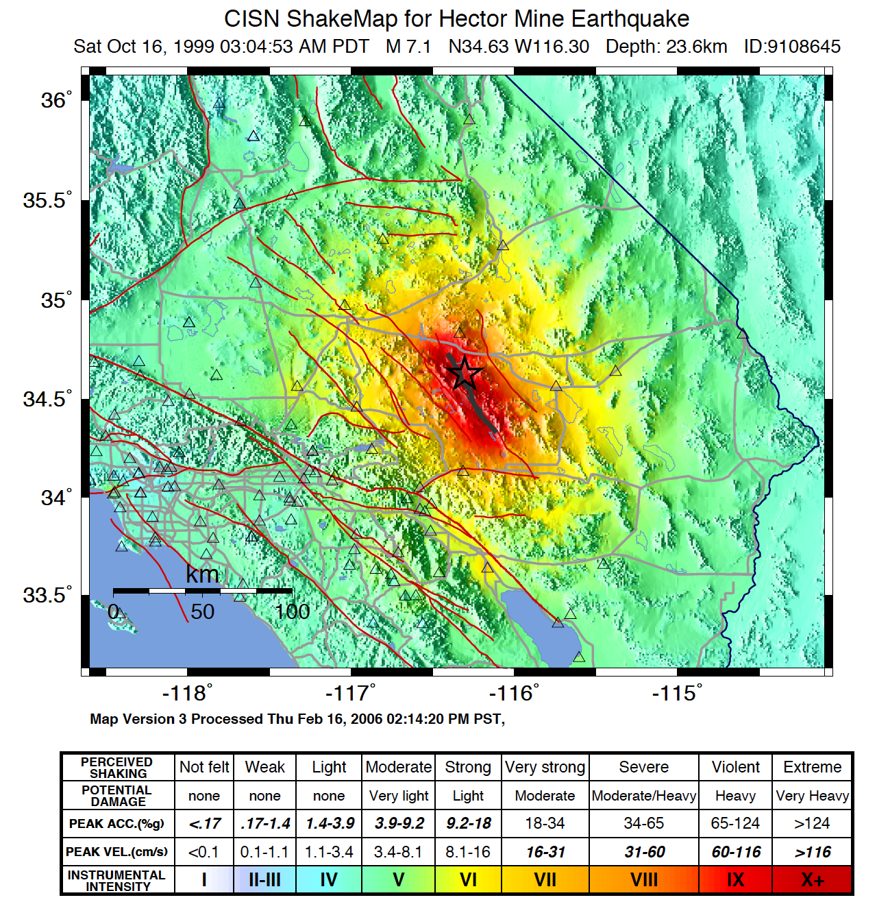

.. _sec_shakemap_applications:

=================================
Applications of ShakeMap
=================================
The distribution of shaking from a significant earthquake, whether expressed as
peak acceleration or intensity, provides responding organizations a significant
increment of information beyond magnitude and epicenter.
Real-time ground-shaking maps provide an immediate opportunity to assess the
scope and impact of an event.  Thus, they can allow emergency managers and
responders to determine what areas were likely subjected to the highest
intensities and what the probable impacts were in those areas.  Importantly,
ShakeMap also allows descision-makers a rapid portrayal of those areas that
received only weak motions and are likely to be undamaged. The latter areas can
be potentially used for mutual aid. 

Though initially developed primarily for emergency management, ShakeMaps have been
shown to be highly beneficial for other user sectors. Other uses include:
improved loss estimation, public information and education through the media and
web pages, financial descision-making, and engineering and seismological
research. Some specific examples are provided below for these use cases. 

As a side benefit, an intensity-based depiction of shaking hazards through
ShakeMap (and DYFI?) facilitates the adoption of the intensity scale more
generally and can thus it can be used for other risk-reduction systems and
purposes. That is, inculcating the populace to shaking using intensity scales
(as opposed to magnitude alone), has becomes crucial not just for communicating
post-earthquake shaking hazards, the color coding and utilization of intensity
has more generally helped depict imminent and future shaking hazards. For
example, the ShakeMap intensity color-palette has been adopted for Earthquake
Early Warning (EEW; see for example `QuakeAlert
<http://www.shakealert.org/faq/>`_) as well as for communicating future hazards
through deterministic scenarios and with Probabilistic Seismic Hazard Maps
(see :ref:`sec_scenarios`). 

Emergency Management and Response
-------------------------------------------------
The value of seismic monitoring and ShakeMap was addressed by a report by the National Research Council's
(NRC) ad-hoc "Committee on the Economic Benefits of Improved Seismic
Monitoring"(:ref:`National Research Council, 20006 <NRC2006>`). In Chapter 7, "Benefits for Emergency Response and Recovery" the
committee describes: 

.. _nrc-committee-report:

	 
   NRC Report on Seismic Monitoring

"The very rapid availability of earthquake source data—including
magnitude, location, depth, and fault geometry—provides basic
orienting information for emergency responders, essential
information for the news media and the public,
and input data for other applications and response-relevant
products. Maps of ground shaking intensity (ShakeMap) have many
important applications in emergency management. Because ShakeMap is available via the
Internet, all emergency responders at all levels of government and
the private sector have access to the same rapidly available information. With this
information, responders can quickly assess the scope of the emergency and
mobilize resources accordingly. Early reconnaissance efforts can target areas known to
have been shaken most severely, and key emergency services
including search and rescue, emergency medical response, safety
assessment of critical facilities, and shelter and mass care can be
expedited based on a more rapid identification of
incident location. Monitored information is also useful for rapidly
assessing situations in which a large, widely felt earthquake
occurs but causes little damage (such as the Hector Mine earthquake
of October 16, 1999). Clearly, there are significant economic
benefits in scaling a response to the consequences of
an event, including no response for an earthquake that requires none."

.. _hector-mine-shakemap:

 
   Instrumental Intensity ShakeMap for the October 16, 1999 magnitude
   7.1 Hector Mine, California Earthquake. (Map regenerated in 2006)

Specifically in the context of disaster management and response in the
U.S., ShakeMap has been recognized as a top priority: "ShakeMap has
become a valuable tool to assist emergency responders in identifying
the likely extent of earthquake damage. Strong-motion data (now
increasingly available in real-time) can be correlated with
documentation and evaluation of the performance of the built
environment, leading to understanding the causes of earthquake damage
and the occurrence of good structural and non-structural performance"
(`Western States Seismic Policy Council Policy Recommendation 14-3 <www.wsspc.org/wp-content/.../PR_14-3_SeismicMonitoring_WebPub.pdf>`_).

Similarly, a report by the National Science and Technology Council `Subcommittee on Disaster Reduction* <www.sdr.gov>`_ (`Grand Challenges for Disaster Reduction: Priority Interagency Earthquake Implementation Actions <www.sdr.gov/docs/185820_Earthquake_FINAL.pdf>`_) describes *Grand Challenge 1*:
"Provide hazard and disaster information where and when it is needed. [...] Expand the Advanced National Seismic System to improve seismic monitoring and deliver rapid, robust earthquake information products; For all urban areas with moderate to high seismic risk, produce ShakeMaps that show the variation of shaking intensity within minutes after an earthquake based on near real time data transmission from densely spaced seismic networks."

.. sidebar:: USE CASE #1

  “Thought you might like to see the [Division of Safety of Dams]
  ShakeCast message for the recent Napa [Aug, 2014] Earthquake.  We have since
  divided the 1250 dams into three fragility classes (called levels of concern).  The message provides explicit instructions on what action
  to take for each dam and transmits owner contact information. The message was received in my inbox 16 minutes after the earthquake,
  which was about 10 minutes after the ShakeMap version 1 was released. The technology has become very well accepted by the field
  inspectors. Thanks for such a great product.” W. A. Fraser, C.E.G.,
  Chief, Geology Branch, CA Division of Safety of Dams, Sacramento, CA.

One of the first examples of the use of ShakeMap for emergency management and response was the 
the magnitude 7.1 Hector Mine earthquake of October 16, 1999 (see :num:`Figure #hector-mine-shakemap`). 
This event provides an important lesson in the use of
ShakeMap to assess the scope of the event and to determine the level of mobilization necessary.
The Hector Mine earthquake produced ground-motion that was widely felt in
the Los Angeles basin and, at least in the immediate aftermath, required an assessment of potential impacts.
It was rapidly apparent, based on ShakeMap, that the Hector Mine earthquake was not a disaster and despite an
extensive area of strong ground shaking, only a few small desert settlements were affected. Thus,
mobilization of a response effort was limited to a small number of companies 
with infrastructure in the region and brief activations of emergency operations centers in
San Bernardino and Riverside Counties and the California Office of Emergency Services
(now the California Emergency Management Agency, or CalEMA), Southern Region.

While prioritizing earthquake response and management is considered
the primary goal of systems like ShakeMap, unnecessary response in an effort to fully assess the potential effects of an
earthquake---although not as costly as inadequate or misguided response in a real
disaster---can be avoided with proper well-constrained shaking information. Had the magnitude-7 earthquake occurred in
urban Los Angeles or another urban area in California, ShakeMap could be
employed to quickly identify the communities and jurisdictions requiring
immediate response.  To help facilitate the use of ShakeMap in emergency
response, ShakeMap is now provided to organizations with critical emergency
response functions automatically through USGS web pages, ShakeCast and similar
tools.

Loss Estimation
----------------------------------------------------------
The `Federal Emergency Management Agency <http://www.fema.org/‎>`_ (FEMA) employs ShakeMap for
post-earthquake damage assessments using HAZUS-MH :ref:`FEMA \(2006\) <fema2006>` loss estimation software.
USGS generates customized formatted ESRI shapefiles for direct input into the
FEMA’s Hazards U.S. (`HAZUS-MH <http://www.fema.gov/hazus>`_ ; :ref:`FEMA
\(2006\) <fema2006>`. The customization includes: specific contour intervals for
all events, geometric mean ground motions (as opposed to ShakeMap standard
maximum component, and peak ground velocity in units of inches/sec rather than
cm/s). The HAZUS-formatted ShakeMap shape files are made available to FEMA for scenarios and
all significant domestic (U.S.) earthquakes 
via Web pages and ArcGIS services (see :ref:`gis_services`). 

The use of ShakeMaps as the shaking hazard input into HAZUS is a major improvement in loss-estimation accuracy
because actual ground-motion observations are used directly to assess damage rather than relying on simpler
estimates based on epicenter and magnitude alone, or from predefined earthquake scenarios built into HAZUS software.

FEMA's HAZUS loss estimates can be important for coordinating State and Federal
response efforts as well as Disaster Declarations. HAZUS's detailed impact
reports can provide focus to the mobilization of resources and
expedite the local, State, and Federal disaster declaration process, thus
initiating the response and
recovery machinery of Government. ShakeMap, when overlaid with inventories of
critical lifelines and 
facilities (e.g., hospitals, utilities, and substations, etc.), highways and
bridges, and vulnerable structures,
provides an important means of  prioritizing response. Such response activities
can include: shelter and mass care,
mutual aid assignments, emergency management, damage and safety assessment,
utility and lifeline restoration,
and emergency public information.

.. figure::  _static/parkfield.hazus.*
   :width: 650px
   :alt: Parkfield 2004 ShakeMap and HAZUS Losses
   :align: left
   :target: Parkfield 2004 ShakeMap and HAZUS Losses
	    
   2004 Parkfield M6.0 earthquake ShakeMap shapefiles (green polygons) and HAZUS estimated impact to selected
   infrastructure (circles) examined. Figure courtesy of D. Bausch, FEMA.

As of 2015, the HAZUS-MH software is run interactively, not automatically, so
qualified FEMA personel must be on hand to initiate HAZUS calculations and post
the results. In addition for heavily-populated areas (major cities in
California, for example), HAZUS software typically can take a few hours to
compute losses. Thus, initial HAZUS-based losses are well behind initial
ShakeMap and PAGER results, and of course they are limited to domestic (U.S.)
earthquakes. However, the HAZUS results provide much greater detail and
information about infrastructure than PAGER-based aggregated losses. 

As described in the section on Scenarios, HAZUS-MH is the standard approach for
delivering loss estimates for ShakeMap scenarios domestically. For real events,
the USGS ShakeMap to FEMA HAZUS handoff has been formalized with a formal
liaison agreement (a Memo of Understanding, MOU) involving Doug Bausch, formerly
of FEMA Region VIII, and David Wald at the USGS NEIC. Because ShakeMap shaking
estimates evolve with time, and HAZUS loss estimates take time to compute, it is
essential that direct communications between the two agencies takes place
immediately after a serious earthquake to allow for optimizing the loss
estimates.

The USGS-FEMA partnership has been activated for several domestic earthquakes
since this system was put into place including: 2004 M6.0 Parkfield, California;
2006 Kiholo Bay, Hawaii; 2010 Virginia, 2010 M7.2 Baja California; 2011 M5.6
Oklahoma; 2011 M5.8 Virginia, and the M6.0 2015 American Canyon (South
Napa), Californa, and several other events. The same approach has been
tested and applied retrospectively against the 1994 Northridge and 1989
Loma Pieta, California, and other events.

Financial Sector Decision-Making
----------------------------------------------------------
Post-earthquake financial decision-making has evolved considerably over the past
decade. Insurers and reinsurers, private companies, governments, and aid
organizations have shown increasing creativity in the utilization of
near-real-time earthquake information for their own loss estimation, financial
adjudication, and situational awareness. Such financial analyses can be of
significant benefit to stakeholders, facilitating risk transfer operations,
fostering sensible management of risk portfolios, and assisting disaster
responders. Ultimately, these improvements translate to benefits for the public
and those at risk (:ref:`Franco, 2015 <franco2015>`).

In general, there are three categories of post-earthquake financial services and
decision-making: 1) analysis of expected losses arising from an actual event
against a portfolio of exposures, 2) the triggering of payments for parametric
insurance products, and 3) the use of quantitative loss estimates to manage
disaster response and aid. Business and public sector portfolio managers can
employ tools like ShakeCast or in-house applications to automatically retrieve
and compute losses based on pre-assigned fragility curves. Within the
(re)insurance sector, catastrophe (CAT) bonds and contingency loans based on
earthquake risk models are often triggered via parametric analyses which are
dependent on earthquake parameters or intensity-measure (IM) estimates as well
as their uncertainties. Anticipating potential losses and acting rapidly and
accordingly is also of utmost importance to emergency management and disaster
aid communities. Estimated losses constitute vital input for rapid situational
awareness, facilitating decision-making on whether or not to commit and deploy
resources, and to what level.

.. sidebar:: USE CASE #2
	     
  The Inter-American Development Bank `<http://www.iadb.org>`_ (IADB) employs ShakeMap for objective post-earthquake assessments for within 72 hours of  any significant earthquake in Latin America and the Caribbean (LACR). IADB's Contingent Credit Facility Loans has set up disaster contingency loans for up to several hundred million USD, conditional on predefined levels of population exposed to ShakeMap intensity VI and higher. Typically, loans can be distributed when the population over intensity VI reaches at least 2% of the population within the coverage area. Loans are available in six LACR countries during the period of availability (J. Martinez, IADB, written communication, 2014).

To a large extent, the advancement of post-earthquake financial instruments has
been facilitated by the availability of rapid and accurate earthquake parameters
and more quantitative geospatial hazard information. Commensurately, USGS
products like ShakeMap and PAGER have evolved to further accommodate specific
requirements of the financial sector. For instance, improved approaches for
quantifying uncertainty can better inform loss estimates and historical ShakeMap
Atlas data can assist in loss model calibration. In addition, USGS now provides
PAGER loss estimates broken down by country to fulfill the need required in the
CAT bond and contingency loan arena, while still remaining within the confines
of reasonable spatial accuracy. Similarly, requests have been made by U.S. State
governments to further compute losses at the state level, although such
resolution is not yet warranted, particularly in areas of sparse real-time
strong-motion instrumentation. Lastly, for many uses, the automatic retrieval
and processing of ShakeMaps has been facilitated via GeoJSON feeds, web-mapping
servers, and the ShakeCast systems. 

Several types of data and information products available or under development
that may be of benefit to the financial sector. The generation of suites of
standardized earthquake scenarios–both domestic and internationally–is underway,
and an update of the global Atlas of ShakeMaps has been completed (see
:ref:`sec_shakemap-archives`). 

There are several continuing challenges that are actively under consideration
and scrutiny: implementing directivity, computing and depicting spatial ground
motion correlations, improved approaches for quantifying and conveying
uncertainties, and a more explicit ShakeMap policy and version control
documentation. :ref:`Wald and Franco \(2016\) <wald2016>` describe how these
advances may in turn facilitate the appearance of new and more refined financial
instruments.
 
Public Information and Education
---------------------------------------------
The rapid availability of ShakeMap on the Internet combined with the urgent
desire for information following a significant earthquake makes this mapping
tool a huge potential source of public information and education. In instances
in which an earthquake receives significant news coverage, the ShakeMap site as
well as the “Did You Feel It?” (DYFI) system receives an enormous increase in
web site visitors (:ref:`Wald et al., 2011 <wald2011c>`). Such opportunities are
amplified by widespread adoption of ShakeMap into media and educational
materials by other institutions. 

ShakeMap's intensity scale is key for introducing and inculcating the public and
the media to the importance of macroseismic intensity rather than the continuing
sole dependence on magnitude as the scale of reference for earthquakes. Although
Japanese Meterological Agency (JMA) Intensity (.e.g., :ref:`JMA, 1996
<jma1996>`) differs slightly from its U.S. MMI counterpart---JMA's is strictly
instrumentally-derived---it is widely used and understood in Japan (e.g.,
:ref:`Celsi et al., 2005 <celsi2005>`). JMA has successfully made intensity the
norm for communicating to the Japanese population about real-time and future
earthquake hazards via television, smartphone, Web content, annual earthquake
drills, and the educational system. Because JMA intensity is widely understood,
public is be more attuned to earthquake risks than populations familiar only
with magnitude descriptions of earthquakes (e.g., :ref:`Celsi et al., 2005
<celsi2005>`). 

"Earthquake education also occurs through the media. The anchoring effect we
report may be lessened significantly if the press consistently used the Mercalli
scale and helped to educate the public about the scale. Research should be
conducted to better understand if and how news organizations can successfully
utilize the Mercalli scale in communicating earthquake information. Alternative
formats, for example, using letters rather than Roman numerals for the
categories, may ameliorate the confusion between magnitude and Mercalli scales.
The experience in Japan provides support for the idea that laypeople can learn
to use the two scales side by side. The Japanese media report both intensities
and magnitude, with viewers maintaining a clearer understanding of the
relationship between magnitude and intensity. In Japan, the overall magnitude
and the intensity are both instrument numbers, with the latter being
location-specific."

The inculcation of the public to intensity is inline with the findings of
:ref:`Gomberg and Jokobitz \(2013\) <gomberg2013>` "Simpler messaging and
explanations are needed by some users,
and this may be achieved by developing two styles of some products, one designed
for nontechnical users and the other tailored for engineers and scientists. The
tangible impacts of an earthquake must be conveyed more simply and succinctly,
employing a scale useful for decision-making at the regional and local levels."

Acknowledging the importance of ShakeMap as a tool for public information and
education, considerable effort was taken to provide the range of formats
suitable for broadcast and Web pages. Initially, Media Maps, simplified versions
of the Instrumental Intensity maps were packaged in a way that makes them more
suitable for broadcast
to low-resolution devices, such as TV monitors: roads and borders are thicker;
fonts are
larger; and the title and intensity scale are simplified, and "TV guide"
information sheet intended to supplement the Media Maps was provided to allow
easier delivery of basic earthquake information. These formats have naturally
evolved to GIS, KML, and now interactive (zoomable) maps that allow
customization of the basemap layers and other content.

However, some of the static maps have made for the most widespread distribution.
A very widely used graphic (:num:`Figure #northridge-nisqually`), for example,
compares ShakeMap-generated intensities for the 1994 Northridge earthquake, a
shallow crustal earthquake near Los Angeles, with the 2001, deep, intraslab
Nisqually, WA, earthquake. This figure was reprinted in numerous reports,
textbooks, classes, reports, and briefings including `Putting Down Roots
<http://www.earthquakecountry.org/roots/shaking.html>`_ and the :ref:`National
Research Council <NRC2006>`, for example.

.. _northridge-nisqually:

.. figure:: _static/Northridge.Nisqually.*
   :align: left
   :width: 650px
 
   Widely adopted graphic of comparing ShakeMaps for the 2001 Nisqually, WA (M6.8), and 1994 Northridge, CA (M6.7) earthquakes showing how distance from an earthquake affects the level of shaking experienced. Even though the magnitude of the Nisqually earthquake was slightly larger than the Northridge earthquake, the shaking was lower on average primarily because the fault that ruptured during the Northridge earthquake was shallower (5-20 km deep) than that for the Nisqually earthquake (about 45-50 km deep).

The continued long-term education of the populous to intensity continues through many TV and other channels,
for instance, in education (e.g., `Larry Braile's undergraduate courses <http://web.ics.purdue.edu/~braile/edumod/eqhazard/eqhazard2.htm>`_), textbooks (e.g., :ref:`Yeats, 2004 <yeats2004>`
"Living with Earthquakes in the Pacific Northwest"),
and `Wikipedia <https://en.wikipedia.org/wiki/2001_Nisqually_earthquake>`_.

Emergency Preparedness
-------------------------------------------------
One of lead leading tools for earthquake emergency preparedness has
been the widespread adoption of `"ShakeOut"
<http://www.shakeout.org/home.html>`_ and other earthquake drills and
planning scenarios. In many of these cases, ShakeMap is employed for
developing both the framework for portraying each earthquake in its
hazard context, and also for computing loss estimates to examine and
communicate its potential societal impact. The initial success of the
Great Southern California ShakeOut (:ref: `Jones et al. (2011
<jones2011>`) has been built by SCEC, USGS, and others into a
worldwide `annual exercise <http://www.shakeout.org/home.html>`_
(Oct 15th each year) involving millions of participants.

On a statewide basis, exercises take place in several of the more
tectonically active areas of the country, for example, `ShakeOuts in
Utah <http://www.shakeout.org/utah/scenarios/>`_ and the 2012
`Evergreen Earthquake Exercise ShakeMaps <http://earthweb.ess.washington.edu/gomberg/ShakeMap/ShakeMaps.html>`_
in Washington State.

Nationwide, FEMA's `National Level Exercises (NLE's)
<http://www.fema.gov/national-exercise-program>` program is
another source for planning for complex, whole-community, large-scale disasters and emergencies.
Here, too, NLE's often employ ShakeMap as the basis for the
exercises. The ShakeMap/HAZUS combination was used for support of the `New Madrid 2011 NLE
<http://www.cusec.org/plans-a-programs/multi-state-planning/156-cusec-new-madrid-seismic-zone-catastrophic-planning-project.html>`_,
involving a magnitude 7.7 New Madrid region mainshock and several
specified significant aftershocks. In 2014, the "Capstone Exercise" NLE was an complex and involved emergency
preparedness exercises including the Alaska Shield 2014 exercise, sponsored by the State of Alaska to
commemorate the 50th anniversary of the 1964 Great Alaskan Earthquake,
yet also involved both significant damage from earthquake shaking and
the tsunami, triggering impacts in the Pacific Northwest. Capstone
further involved the Department of Defense (DOD) aligned key components
Capstone Exercise with a connected "Ardent Sentry" exercise with the
same ShakeMap input in order for DOD to focus on defense support to civilian authorities.

.. _caribewave-nle:

.. figure:: _static/caribewave.onepager.*
   :align: left
   :width: 550px
   :alt: Caribe Wave OnePAGER
	 
   Annual "Caribe Wave" earthquake and tsunami exercise for the Caribbean region.
	   
Internationally, USGS participates through (NOAA) in an annual "Caribe
Wave" earthquake and tsunami exercise for the Caribbean region, most
recently,  (:ref:`IOC, 2012 <ioc2012>`; see :num:`Figure #caribewave-nle`).

The USGS ShakeMap and PAGER group also work directly with the U.S.
Agency for International Development (USAID) Office of Foreign
Disaster Assistance (OFDA), the World Bank, Geohazards International (GHI), among other agencies, countries, and NGO's to
develop global planning exercises and scenarios. 

Earthquake Engineering and Seismological Research
-----------------------------------------------------

For potentially damaging earthquakes, ShakeMap produces response spectral
acceleration grid values for three periods (0.3, 1.0, and 3.0 s). The
spectral acceleration values are used for loss estimation, as
mentioned above, yet these IMs also serve many earthquake engineering analysis purposes. In a
post-earthquake environment, information from engineering analyses of structures
(including via ShakeCast, see below) provides a framework for post-earthquake
occupancy, tagging, and damage inspection by civil engineers.

ShakeMap products and metadata aggregate earthquake source
information, shaking intensity both seismic and macroseismic observations, 
(IMs), as well as fault geometries and station-sources distances. 
In addition to providing these data systematically for recent events,
the same constraints are made available for numerous earthquakes, both for recent events
(Archives) as well has historic and events (Atlas).

The aggregation of earthquake information and fault geometries---in
conjunction with reported shaking and macroseismic data---provide the
basis for analyses of best-estimate ground motion IM's at specific
sites for comparison with human behavior and response by both the
natural and built environments. Here is a
sampling of the range of studies these data and products motivate and facilitate:

**Example Engineering Research and Analyses:**

* Analyses of potential damage to column/beam welds in steel
  buildings following the 1994Northridge earthquake*
* ATC-54: Guidelines for using strong-motion data and ShakeMaps in
  Post-Earthquake Response.*; :ref:`ATC 2002 <atc2002>`.
* An Empirical Model for Global Earthquake Fatality
  Estimation*; :ref:`Jaiswal and Wald (2010) <jaiswal2010>`.
* Pomonis, A. and So. E. (2011) Guidelines for the Collection of
  Consequence Data, Global Earthquake Consequences Database Global
  Component Project; :ref:`Pomonis and So (2011) <pomonis2011>`.
   
**Example Seismological Research and Analyses:**

* Intensity attenuation for active crustal regions*; :ref:`Allen et al, 2012 <allen2012>`. 
* Ground Motion to Intensity Conversion Equations (GMICEs): A Global
  Relationship and Evaluation of Regional Dependency.*; :ref:`Caprio
  et al. (2015) <caprio2015>`.
* Fault extent estimation for near-real time ground shaking map
  computation purposes*; :ref:`Convertito et al. (2011)
  <convertito2011>`.
* Bayesian Estimations of Peak Ground Acceleration and 5% Damped
  Spectral Acceleration from Modified Mercalli Intensity Data*;
  :ref:`Ebel and Wald (2003) <ebel2003>`.
* Regression analysis of MCS intensity and ground motion parameters
  in Italy and its application in ShakeMap*; :ref:`Faenza and Michilini (2010) <faenza2010>`
* A Global Earthquake Discrimination Scheme to
  Optimize Ground-Motion Prediction Equation Selection*; :ref:`Garcia
  et al. (2012) <garcia2002b>`.
  

