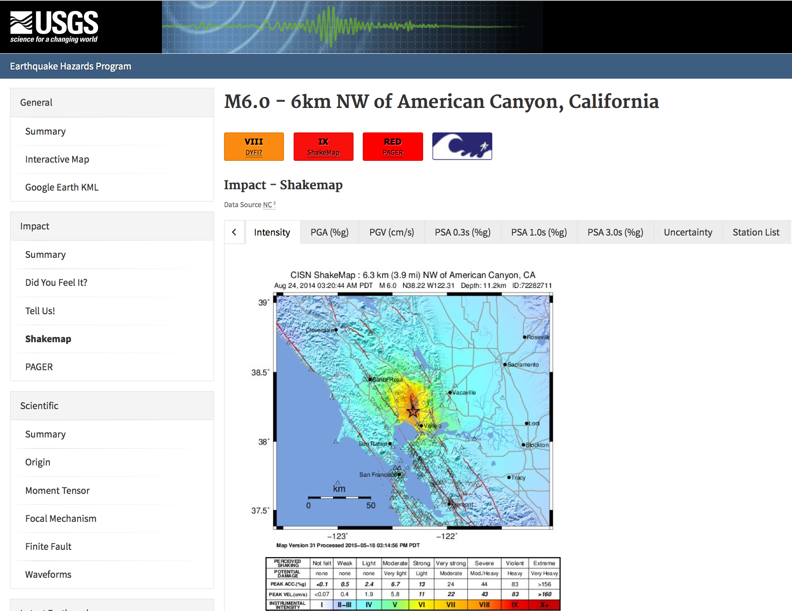
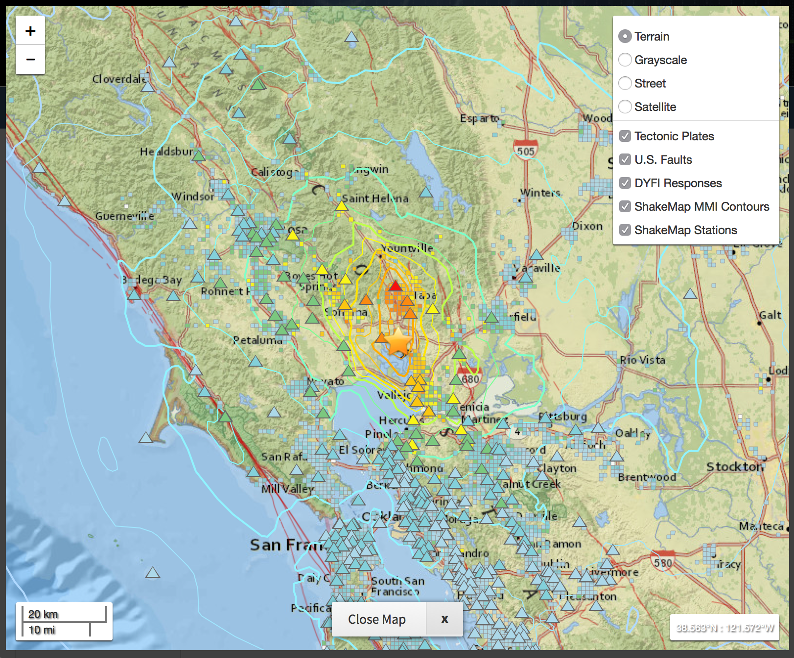

.. image:: _static/usgs_banner.*

.. _users-guide:

####################
User's Guide
####################

ShakeMap originated primarily as an internet-based system for real-time display.  Although the online color-coded intensity maps are the most visible result of ShakeMap system and constitute the most commonly accessed and downloaded product, they are just one representation of the ShakeMap output. ShakeMap also produces grids of peak ground acceleration and velocity amplitudes, peak spectral response values, instrumental intensities, seismic station files, fault files, metadata, regression plots, contours, metadata, and uncertainty estimates. The ShakeMap web pages also serve a variety of formats including: PDF, KML, XML, GeoJSON, HAZUS-MH,  GIS files, ESRI Raster, and a host of other formats and products for the varied user needs and applications.

In this User's Guide, after some background, we present the range ShakeMap products and describe the available formats. The different automated mechanisms to receive and utilize ShakeMap, including GIS Web Services and GeoJSON feeds, and via ShakeCast are described and links to these are provided. Many users also take advantage of real-time ShakeMaps, as well as older events and earthquake planning scenarios, so we describe the three primary ShakeMap repositories: Earthquake Real-time, historic ShakeMap Atlas events, and a collection of Scenario ShakeMaps.

Next is an overview of the current ShakeMap users and applications. Beyond quickly assessing the overall domain of shaking, ShakeMap is used across many sectors: planning and response, loss estimation, financial services, education and outreach, and engineering and seismological research. We provide examples of each. The section that follows expands on how ShakeMap integrates with related systems of DYFI, ShakeCast and PAGER. Lastly, and importantly, **Disclaimers** that users should be aware of and refer to when employing ShakeMap for decision-making.

===================
Background
===================

Until the development of ShakeMap, the most common information available immediately following a significant earthquake was typically its magnitude and epicenter.  However, the damage pattern is not a simple function of these two parameters alone, and more detailed information must be provided to properly ascertain the situation.  For example, for the magnitude-6.7 February 9, 1971, California earthquake, the northern San Fernando Valley was the region with the most damage, even though it was more than 15 km from the epicenter.  Likewise, areas strongly affected by the 1989 Loma Prieta and 1994 Northridge, California, earthquakes (magnitudes 6.9 and 6.7, respectively) that were either distant from the epicentral region or out of the immediate media limelight were not fully appreciated until long after the initial reports of damage. The full extent of damage from the magnitude-6.9 1995 Kobe, Japan, earthquake was not recognized by the central government in Tokyo until many hours later (e.g., Yamakawa, 1997), seriously delaying rescue and recovery efforts.

A ShakeMap is a representation of ground shaking produced by an earthquake. The information it presents is different from the earthquake magnitude and epicenter that are released after an earthquake because ShakeMap focuses on the ground-shaking produced by the earthquake, rather than the parameters describing the earthquake starting point (its hypocenter) and size (magnitude). So, although an earthquake has one magnitude and one epicenter, it produces a range of ground shaking levels at sites throughout the region, depending on distance from the earthquake fault that ruptured, the rock and soil conditions at sites, and variations in the propagation of seismic waves from the earthquake due to complexities in the structure of the Earth's crust. 

Part of the strategy for generating rapid-response ground-motion maps was to determine the best format for reliable presentation of the maps given the diverse audience, which includes scientists, businesses, emergency response agencies, media, and the general public.  In an effort to simplify and maximize the flow of information to the public, we have developed a means of generating not only peak ground acceleration and velocity maps, but also an instrumentally-derived, estimated Modified Mercalli Intensity (MMI) map.  This “instrumental intensity” map makes it easier to relate the recorded ground-motions to the expected felt and damage distribution. At the same time, we preserve a full range of utilities of recorded ground-motion data by producing maps of response spectral acceleration, which are not particularly useful to the general public, but which provide fundamental data for loss estimation and earthquake engineering assessments.

ShakeMap provides maps of **peak** ground-acceleration, velocity and spectral acceleration maps as well as Modified Mercalli Intensity. Intensity ShakeMaps depict estimated intensities derived from peak ground motions as well as (optionally) from reported intensities. Intensity maps make it easier to relate the recorded and estimated ground motions to the expected felt and damage distributions. Estimating intensities from ground shaking is based on analyses of intensities reported near recorded seismic stations for past earthquakes. The legend on the ShakeMap indicates which relationship was used to estimate intensities from ground motions, and vice versa (see the ShakeMap :ref:`technical-guide`).

Station locations are the best indicator of where the map is most accurate: Near seismic stations the shaking is well constrained by data; far from such stations, the shaking is estimated using standard seismological inferences and geospatial interpolation. Details about the interpolation, uncertainty maps, and codes for the seismic station components, network contributors, and potential outlier or clipped flag codes are provided in the :ref:`technical-guide`. Peak horizontal acceleration and spectral acceleration values are in units of percent-g (where g = acceleration due to the force of gravity = 981 cm/s/s). The peak values of the vertical components are not used in the construction of the maps. Peak velocity values are given (in cm/sec) at each station. Acceleration spectra are the response of a 5% critically damped, single-degree-of-freedom oscillator to the recorded ground motion at three reference periods: 0.3, 1.0, and 3.0 seconds. 

=========================
Products and Formats
=========================
ShakeMap is fundamentally a geographic product: the spatial representation of the potentially very complex shaking associated with an earthquake. Because of its complicated nature, we are required to generate numerous maps that portray various aspects of the shaking that are customized for specific uses or audiences.  For some uses, it is not the maps but the components that make up the ShakeMaps that are of interest in order to recreate or further customize the maps.  In this section we further describe these ShakeMap component products and the variety of maps and formats.

Input Files
---------------------
The downloadable products include sufficient information to reproduce the ShakeMap. In particular, stationlist.xml and the fault .txt file(s) provide the input files, *grid.xml* provides the Vs30 grid (see above), and *info.xml* provides the important configuration and processing parameters [including the name(s) of the fault file(s)].

*Station Lists*. The file stationlist.xml contains the combined input data from all of the original processing center’s input files in a ShakeMap-readable format. The file may contain seismic station data, intensity data, or a combination of both. The file also contains an event tag with the earthquake source specifications. [Note: At this time it is necessary to copy the event tag and place it in a file *event.xml* in the event’s input directory for ShakeMap to process the event normally. We hope to remove this requirement in a future release.] See the ShakeMap :ref:`software-guide` for a complete specification of the ShakeMap input XML formats.

For reasons of backward compatibility we also provide *stationlist.txt*. As with grid.xyz the use of this file is deprecated and it may disappear in a future release.

*Fault Files*. Fault files are named *<something>_fault.txt* and are listed in *info.xml*. Zero or more fault files may be present in the ShakeMap input directory. See the ShakeMap :ref:`software-guide` for a complete specification of the fault file format. For the purposes of reproducing the ShakeMap for an earthquake, it is sufficient to copy the specified file(s) into the event’s input directory.

Output Files and Products
---------------------------------

For each ShakeMap, all maps and associated products for that event are available via the “Downloads” link on the earthquake-specific Web pages. A table of each of these products include (and each is described in more detail in the sections that follow):

* **Metadata and Runtime Information**
   * FGDC-compliant metadata 
   * XML file of processing and constraints parameters, input data, output paramaters, timestamps, and versioning.

* **Static Maps and Plots (Images)**
   * Macroseismic Intensity
   * Peak Ground Acceleration, Peak Ground Velocity, and Pseudo-Spectral Acceleration (when appropriate)
   * Uncertainty Maps
   * Regression (GMPE) Plots  
   * Station Lists**
   
* **Interactive Maps**
   * Station Lists**

* **Grids of interpolated ground shaking**
   * XML grid of ground motions
   * XML grid of ground motions on “rock”
   * XML grid of ground-motion uncertainty
   * Text grid of ground motions (deprecated)

* **GIS files**
   * GIS Shapefiles
   * `HAZUS-MH® <http://www.fema.gov/hazus/>`_ Shapefiles
   * `ESRI <http://www.esri.com>`_ Raster Grid Files
   * `Google Earth <http://earth.google.com>`_ KML files
   * Contour Files

Metadata and Runtime Information
^^^^^^^^^^^^^^^^^^^^^^^^^^^^^^^^^^^^^^^^^^^^
**Metadata**. FGDC-compliant geospatial metadata files are distributed via the earthquake-specific ShakeMap Web page for each earthquake under the *Download* page. The metadata are provided in text, HTML, and XML formats in the files *metadata.txt*, *metadata.html*, and *metadata.xml*, respectively. 

**Supplemental Information**. A second aggregation of important earthquake-specific ShakeMap information is provided online in the file *info.xml*. This supplemental information provides a machine-readable (XML) rundown of many important ShakeMap processing parameters. It includes information about the data and fault input files, the source mechanism, the GMPE, IPE, and GMICE selected, the type and source of the site amplifications, the map boundaries, and important output information including the bias and maximum amplitude for each parameter. The *info.xml* is critical for understanding or replicated any particular specific ShakeMap.

.. note:: **Timestamps, versions of the ShakeMap software employed, event-specific parameters, and the version of the specific ShakeMap run** are documented in the supplemental information provided in the *info.xml* file.

Because the grid is the fundamental derived product from the ShakeMap processing, it is fully described in an accompanying metadata file following Federal Geographic Data Committee (`FGDC <https://www.fgdc.gov/>`_) standards for geospatial information.  As described below, station amplitudes are provided in separate ShakeMap station files, yet the metadata for the parametric data are archived by the regional seismic networks and contributing strong motion data sources. 

Static Maps and Plots (Images)
^^^^^^^^^^^^^^^^^^^^^^^^^^^^^^^^^^^^^^^^^
ShakeMap generates a number of static ground-motion maps and plots for various parameters (ground motion metrics, or IM's). Most of these maps are available in JPEG format, as well as zipped PostScript files which---as vector-based images---are suitable for PDF conversion or editing. These maps are typically generated automatically limiting the format, extent and features that can be depicted. Nonetheless, these static maps are ShakeMap "signature products" and serve as maps of record and for other purposes, as described below. Static maps can be accessed and selected tabs along the top of the USGS earthquake event page as shown in the example in :num:`Figure #Nap.Event.Page`.

.. _Napa.Event.Page:

   Event Page ShakeMap view for the Aug. 24, 2014, M6.0 American Canyon (Napa Valley), California,
   earthquake. Tabs allow access and comparison of different intensity measures (IM's), as well as the uncertainty map
   and station list.

**Intensity maps**. Intensity images---typically of Modified Mercalli Intensity (MMI), but potentially other intensity measures---are the most familiar ShakeMap products. The main intensity map consists of a colored overlay of intensity with the epicenter (and the causative fault, if supplied) prominently marked, (usually) overlain upon the region’s topography, with other cultural and geologic features (cities, roads, and active faults) plotted, depending on the configuration of the ShakeMap system. A detailed scale of intensity is also provided as previously described in detail (see :ref:`technical-guide`)

.. note:: **ShakeMap Symbology**. It is ShakeMap convention to depict seismic stations as **triangles** and intensity observations as **circles** (for cities) or **squares** (for geocoded boxes). On intensity maps, symbols are see-thru so that the underlying intensity values are visible. On peak ground motion maps observations are (optionally) color-coded to their amplitude according to the legend shown below each map. The epicenter is indicated with a **star**, and for larger earthquakes the surface projection of the causative fault is shown with **black lines**.
	  
Strong motion and intensity data symbols default to "see thru" mode for the intensity map shown in :num:`Figure #Napa.ShakeMap.cover` and are color filled for peak ground motion maps :num:`Figure #Napa.PGA`. ShakeMap operators may chose to modify these defaults using alternative mapping configurations.

.. _figure.Napa.ShakeMap.cover:
.. figure:: _static/Napa.ShakeMap.cover.*
   :width: 650px
   :align: left

   Intensity ShakeMap from the Aug. 24, 2014, M6.0 American Canyon (Napa Valley), California, earthquake. Strong motion data
   (triangles) and intensity data (circles) default to "see thru" mode for the intensity map. The
   north-south black line indicates the fault location and the epicenter is red star. The intensity
   color-coding either as observed (for macroseismic data) or as converted is derived from the conversion equations of:ref:`Wald et al. \(1999b\)
   <wald1999b>` as shown in the legend. Note: Map Version Number reflects separate offline processing for this Manual.

.. _Napa.PGA:
.. figure:: _static/Figure_1_2.*
   :scale: 75%
   :align: left

   Peak acceleration ShakeMap from the Aug. 24, 2014, M6.0 American Canyon (Napa Valley), California,
   earthquake. Strong motion data (triangles) and intensity data (circles are color-coded according to their intensity
   value, either as observed (for macroseismic data) or as converted as derived by
   :ref:`Wald et al. \(1999b\)  <wald1999b>` as shown in the
   legend. The north-south black line indicates the fault location, which nucleated near the epicenter (red star). Note:
   Map Version Number reflects separate offline processing for this Manual.

**Peak Ground Motion Maps.** ShakeMap generates static maps for PGA, PGV and Intensity---and optionally---three separate maps for peak spectral accelerations (0.3, 1.0, 3.0 sec periods). The peak ground motions are distinct from intensity maps: shaking values on the former are colored image overlays; the latter are peak ground motion contours. On peak ground motion maps station fill colors indicate the ground motion of the station converted to intensity or, optionally,
the identity of the seismic network data source. When the color indicates peak ground motion, the values are converted to the intensity color scheme via the selected ground motion intensity conversion equation (GMICE), and the corresponding color scale bar is provided at the bottom of the map (see example in :num: `Figure #Napa.PGA`). 

Interactive Maps
^^^^^^^^^^^^^^^^^^^^^^^^^^^^^^^^^^     
Although the static ShakeMaps useful, many of these products are more suitably served as interactive maps which can be dynamic scaled (zoomed) and layered upon with user-selected background and other overlays. The layers are provided via GeoJSON, KML, GIS, Raster, and other formats. The USGS Earthquake Program Web pages employ `Leaflet <http://leafletjs.com/>`_, an open-source JavaScript library that suitable for mobile-friendly interactive maps. Many of the interactive features are geared towards balancing the experience for both desktop as well as mobile visitors. Since the interactive maps are zoomable, it is convenient to select ("clicking") individual stations to query station information and amplitudes (see the example in Figure 3).

.. _figure.napa.contours:
.. figure:: _static/Napa_contours.station.png
   :scale: 40%
   :align: left

   Interactive ShakeMap for the Aug. 24, 2014, M6.0 American Canyon (Napa Valley), California,
   earthquake. Contours indicate intensities; strong motion data (triangles) and intensity data (circles are
   color-coded according to their intensity value, either as observed (for macroseismic data) or as converted
   as derived by Worden et al. (2012). Inset on lower map shows pop-up station information.
    
USGS Earthquake Program Web pages employ `Leaflet <http://leafletjs.com/>`_, an open-source JavaScript library that suitable for mobile-friendly interactive maps. On the interactive map, selecting ("clicking") a the stations will bring up a list of the stations and their amplitudes. Figure 3 shows a different representation of the intensity map on the newer, "interactive" maps on the USGS web site. The interactive map also allows users to select specific layers, including seismic stations, and DYFI? geocoded intensity
stations. 	  
   
.. note:: Currently, interactive map only portray contours of intensity. Other contours can be downloaded for users' programs, or overlain with the GIS or KML formats provided with each ShakeMap.

.. _figure.napa-stationpopup:
.. figure:: _static/Napa_contours.station.popup.*
   :scale: 40%
   :align: left 

   Interactive ShakeMap for the Aug. 24, 2014, M6.0 American Canyon (Napa Valley), California,
   earthquake. Contours indicate intensities; strong motion data (triangles) and intensity data (circles are
   color-coded according to their intensity value, either as observed (for macroseismic data) or as converted
   as derived by Worden et al. (2012). pop-up station information.

.. _figure.napa-mobile:
.. figure:: _static/Napa.mobile.shakemap.png
   :scale: 45%
   :align: right

   Mobile view of the interactive ShakeMap for the Aug. 24, 2014, M6.0 American Canyon (Napa Valley), California,
   earthquake. Contours indicate intensities; strong motion data (triangles) are color-coded according to their intensity
   value.
	   
.. _figure.napa-dyfi:

   Interactive ShakeMap for the Aug. 24, 2014, M6.0 American Canyon (Napa Valley), California,
   earthquake. On the interactive map, reported (DYFI?) intensities on geocoded onto are represented with
   **squares** depicting the 1-km grid area they occupy. Reported Intensities are color-coded according to their intensity
   value, either as observed or as converted as derived by Wald et al. (1999). 

**Uncertainty Maps**. As discussed in detail in the :ref:`technical-guide`, gridded uncertainty is available for all ground motion parameters, as well as the ratio of the ShakeMap PGA uncertainty to the GMPE’s uncertainty (see the section on :ref:`sec_interpolation`). 

We utilize the uncertainty ratio to produce a graded map of uncertainty. Where the ratio is 1.0 (meaning the ShakeMap is purely predictive), the map is colored white. Where the ratio is greater than 1.0 (meaning that the ShakeMap uncertainty is high because of unknown fault geometry) the map shades toward dark red, and where the uncertainty is less than 1.0 (because the presence of data decreases the uncertainty) the map shades toward dark blue. These maps provide a quick visual summary of quality of the ground motion estimates over the area of interest.

ShakeMaps are also given a letter grade, based on the mean uncertainty ratio within the area of the MMI 6 contour (on the theory that this is the area most important to accurately represent). A ratio of 1.0 is given a grade of “C.” Maps with mean ratios greater than 1.0 get grades of “D” or “F.” Ratios less than 1.0 earn grades of “B” or “A.” If the map does not contain areas of MMI ≥ 6, no grade is assigned. See the example map below.

.. _figure.napa.urat:
.. figure:: _static/Napa.urat_pga.jpg
   :width: 650px
   :align: left 

   ShakeMap uncertainty maps for the Aug. 24, 2014, M6.0 American Canyon (Napa Valley), California,
   earthquake. Color-coded legend shows uncertainty ratio, where ‘1.0’ indicates 1.0 times the GMPE’s sigma. The average
   uncertainty is computed by averaging uncertainty at grids that lie within the MMI=VI contour (bold contour line). For more
   details see Wald et al. (2008), Worden et al. (2010), and the :ref:`technical-guide`
   
**Regression (GMPE and Distance Attenuation) Plots.**

Interpolated Ground Motion Grids
^^^^^^^^^^^^^^^^^^^^^^^^^^^^^^^^^^^^^^^^^^^^^^^^^

.. _sec_interpolated_grid_file:
     
Interpolated Grid Files
^^^^^^^^^^^^^^^^^^^^^^^^^

As described in the Technical Manual, the fundamental output product of the ShakeMap processing system is a finely sampled grid of latitude and longitude pairs with associated amplitude values of shaking parameters at each point.  These amplitude values are derived by interpolation of a combination of the recorded ground shaking observation and estimated amplitudes, with consideration of site amplification at all interpolated points.  The resulting grid of amplitude values provides the basis for generating color-coded intensity contour maps, for further interpolation to infer shaking at selected locations, and for generating GIS-formatted files for further analyses.

**XML Grid**. The ShakeMap XML grid file is the basis for nearly all ShakeMap products, as well as for computerized post-processing in systems such as ShakeCast and PAGER [see :ref:`sec_related-systems`]. The XML grid is available as both plain text (*grid.xml*) and compressed as a zip file (*grid.xml.zip*).

As XML, the grid is meant to be self-describing, however we describe the format here for the sake of completeness.

After the XML header, the first line is the shakemap_grid tag:

 ::

   <shakemap_grid xsi:schemaLocation="http://earthquake.usgs.gov
   http://earthquake.usgs.gov/eqcenter/shakemap/xml/schemas/shakemap.xsd" event_id="19940117123055" 
   shakemap_id="19940117123055" shakemap_version="2" code_version="3.5.1446" process_timestamp=
   "2015-10-30T20:38:19Z" shakemap_originator="us" map_status="RELEASED" shakemap_event_type=
   "ACTUAL"><event event_id="19940117123055" magnitude="6.6" depth="19" lat="34.211000" lon="-118.546000"  
   event_timestamp="1994-01-17T12:30:55UTC" event_network="us" event_description="Northridge,
   California"/><grid_specification lon_min="-120.296000" lat_min="32.763750" lon_max="-116.796000" 
   lat_max="35.658250" nominal_lon_spacing="0.008333" nominal_lat_spacing="0.008341" nlon="421"
   nlat="348"/><event_specific_uncertainty name="pga" value="0.442632" numsta="871"/><event_specific_
   uncertainty name="pgv" value="0.488617" numsta="868"/><event_specific_uncertainty name="mi" value="0.677466" 
   numsta="875"/><event_specific_uncertainty name="psa03" value="0.514850" numsta="864"/><event_specific_
   uncertainty name="psa10" value="0.541189" numsta="869"/><event_specific_uncertainty name="psa30" 
   value="0.568793" numsta="867"/><grid_field index="1" name="LON" units="dd"/><grid_field index="2" 
   name="LAT" units="dd"/><grid_field index="3" name="PGA" units="pctg"/><grid_field index="4" name="PGV"
   units="cms"/><grid_field index="5" name="MMI" units="intensity"/><grid_field index="6" name="PSA03"
   units="pctg"/><grid_field index="7" name="PSA10" units="pctg"/><grid_field index="8" name="PSA30"
   units="pctg"/><grid_field index="9" name="STDPGA" units="ln(pctg)"/><grid_field index="10" name="URAT"
   units=""/><grid_field index="11" name="SVEL" units="ms"/><grid_data>

Aside from schema information, the shake_map grid tag provides the following attributes:

 :: 

  *event_id*:  Typically this will a string of numbers and/or letters with with or without a network
  ID prefix (e.g., “us100003ywp”), though in the case of major historic earthquakes, scenarios, or
  other special cases it may be a descriptive string, as above (“Northridge”).
  *shakemap_id*: Currently the same as event_id, above.
  *shakemap_version*: The version of this map, incremented each time a map is revised or reprocessed 
  and transferred.
  *code_version*: The version of the ShakeMap software used to make the map.
  *process_timestamp*: The date and time the event was processed.
  *shakemap_originator*: The network code of the center that produced the map.
  *map_status*: Currently always the string “RELEASED” but other strings may be used in the future.
  *shakemap_event_type*: Either “ACTUAL” (for real earthquakes) or “SCENARIO” for scenarios.

The next tag describes the earthquake source:

 ::

  <event event_id="Northridge" magnitude="6.7" depth="18" lat="34.213000" lon="-118.535700"
   event_timestamp="1994-01-17T12:30:55GMT" event_network="ci" event_description="Northridge" />

Most of the attributes are self-explanatory:

 :: 

  *event_id*: See above.
  *magnitude*: The earthquake magnitude.
  *depth*: The depth (in km) of the earthquake hypocenter.
  *lat/lon*: The latitude and longitude of the earthquake epicenter.
  *event_timestamp*: The date and time of the earthquake.
  *event_network*: The authoritative seismic network in which the earthquake occurred.
  *event_description*: A string containing the earthquake name or a location string (e.g., “13 km SW of Newhall, CA”).

Following the event tag is the grid_specification tag:

 ::

   <grid_specification lon_min="-119.785700" lat_min="33.379666" lon_max="-117.285700" 
   lat_max="35.046334" nominal_lon_spacing="0.008333" nominal_lat_spacing="0.008333" nlon="301"
   nlat="201" />
  *lon_min/lon_max*: The boundaries of the grid in longitude.
  *lat_min/lat_max*: The boundaries of the grid in latitude.
  *nominal_lon_spacing*: The expected grid interval in longitude within the resolution of the 
  numeric format of the output.
  *nominal_lat_spacing*: The expected grid interval in latitude within the resolution of the 
  numeric format of the output.
  *nlon/nlat*:	The number of grid points in longitude and latitude. The grid data table will contain nlon times nlat rows.

This is followed by a number of grid_field tags:

 ::

 <grid_field index="1" name="LON" units="dd" />
 <grid_field index="2" name="LAT" units="dd" />
 <grid_field index="3" name="PGA" units="pctg" />
 <grid_field index="4" name="PGV" units="cms" />
 <grid_field index="5" name="MMI" units="intensity" />
 <grid_field index="6" name="PSA03" units="pctg" />
 <grid_field index="7" name="PSA10" units="pctg" />
 <grid_field index="8" name="PSA30" units="pctg" />
 <grid_field index="9" name="STDPGA" units="ln(pctg)" />
 <grid_field index="10" name="URAT" units="" />
 <grid_field index="11" name="SVEL" units="ms" />

Each tag specifies a column in the grid table that follows.

 ::

  index:  The column number where the specified parameter may be found. The first column is column “1.”
  name:   Description of the parameter in the given column.
  LON:    Longitude of the grid location (the “site”).
  LAT:    Latitude of the site.
  PGA:    Peak ground acceleration at the site.
  PGV:    Peak ground velocity.
  MMI:    Seismic intensity.
  PSA03:  0.3 s pseudo-spectral acceleration.
  PSA10:  1.0 s pseudo-spectral acceleration.
  PSA30:  3.0 s pseudo-spectral acceleration.
  STDPGA: The standard error of PGA at the site (in natural log units).
  URAT:   The uncertainty ratio. The ratio STDPGA to the nominal standard error of the GMPE at the site (no units).
  SVEL:   The 30-meter shear wave velocity (Vs30) at the site.

The measurement units:

 ::

   dd:   	Decimal degrees.
   pctg: 	Percent “g” (i.e., nominal Earth gravity).
   cms: 	Centimeters per second.
   intensity: 	Generally Modified Mercalli Intensity, but potentially other intensity measures.
   ms: 		Meters per second.
   ln(pctg):	Natural log of percent g.
   ln(cms):	Natural log of centimeters per second.

The number of grid_field tags will vary: smaller-magnitude earthquakes may not have the pseudo-spectral acceleration values; scenarios will not have STDPGA or URAT; maps that have not been site corrected will not have SVEL.

The grid_field tags are followed by the grid_data tag, the gridded data, and the closing tags:

 ::

  <grid_data>
  -119.7857 35.0463 4.3 4.21 5.26 5.76 5.76 1.09 0.5 1 800
  -119.7774 35.0463 4.34 4.23 5.27 5.8 5.78 1.1 0.5 1 800
  -119.7690 35.0463 4.37 4.25 5.27 5.84 5.81 1.1 0.5 1 800
  …
  </grid_data>
  </shakemap_grid>

The fast index for the coordinates is longitude, the slow index is latitude. Dimensions are from upper left to lower right (i.e., from longitude minimum/latitude maximum to longitude maximum/latitude minimum). The GMT program *xyz2grd* (coupled with *gmtconvert*) is particularly useful for converting the grid.xml data into a usable grid file.

**Rock Grid XML**. The file *rock_grid.xml.zip* is a zipped XML file containing the interpolated grid without site amplifications applied. The rock grid has the same structure as *grid.xml*, but Vs30 values and PGA uncertainty values are not supplied. :ref:`amplify_ground_motions` in the :ref:`technical-guide`. 

**Uncertainty Grid XML**. The file *uncertainty.xml.zip* is a zipped XML file containing the standard errors for each of the ground-motion parameters at each point in the output grid. It has the same structure as *grid.xml*, with the additional grid_field names:

 ::

  STDPGA:	Standard error of peak ground acceleration.
  STDPGV:	Standard error of peak ground velocity.
  STDMMI:	Standard error of seismic intensity.
  STDPSA03:	Standard error of 0.3 s pseudo-spectral acceleration.
  STDPSA10:	Standard error of 1.0 s pseudo-spectral acceleration.
  STDPSA30:	Standard error of 3.0 s pseudo-spectral acceleration.

The standard errors are given in natural log units, except for intensity (linear units). The PSA entries will be available only if the PSA ground motion parameters were mapped (typically only for earthquakes of M ≥ 5.0.

No ground motion data or Vs30 values are available in *uncertainty.xml.zip*; for those, use *grid.xml.zip*.

**Grid XYZ**. *grid.xyz* is a plain-text, comma-separated, file of gridded ground motions.

.. note:: the use of this file is deprecated. It is difficult to maintain and have it remain backward compatible. All users are urged to use the XML grids instead, and to switch to the XML grids if they are using *grid.xyz*. *grid.xyz* will disappear in a future ShakeMap release.

Station Lists
^^^^^^^^^^^^^^^^^^^^
Station Lists of input data, TXT, XML, JSON

.. _figure.napa.station.table:
.. figure:: _static/Napa.station.table.png
   :width: 650px
   :align: left

   Station table view from ShakeMap event-specific web pages. Link is at right of tabs above the map (See Figure 1)

ShakeMap presents flagged stations as open, unfilled triangles on maps and on regression plots. In contrast, unflagged stations are color coded by network or, optionally, by their amplitudes via their converted intensity value, as shown in Figure 3. Flagged stations are also indicated as such within tables produced for ShakeMap web page consumption, e.g., the stations.xml file.

	
GIS Products
^^^^^^^^^^^^^^^^^^^^
ShakeMap processing does not occur in a Geographic Information System (GIS), but we post-process the grid file (above) into raster and shape files for direct import into GIS. The file base names in each archive are abbreviations of the type of ground-motion parameter:

 ::

	mi    =  macroseismic intensity (usually, but not necessarily, mmi)
	pga   =  peak ground acceleration
	pgv   =  peak ground velocity
	psa03 =  0.3 s pseudo-spectral acceleration
	psa10 =  1.0 s pseudo-spectral acceleration
	psa30 =  3.0 s pseudo-spectral acceleration

The sub-sections that follow describe available file and product types.

*Shapefiles*. GIS shape files are comprised of four or five standard associated GIS files:

 :: 

  .dbf = A DBase file with layer attributes
  .shp = The file with geographic coordinates
  .shx = An index file 
  .prj = A file containing projection information 
  .lyr = A file containing presentation properties (only available for PGA, PGV, and MMI)

In this application, the shape files are contour polygons of the peak ground-motion amplitudes in *ArcView* shape files. These contour polygons are actually equal-valued donut-like polygons that sample the contour map at fine enough intervals to accurately represent the surface function. We generate the shape files independent of a GIS using a shareware package (*shapelib.c*). Contouring, as well as polygon formation and nesting, is performed by a program written in *C* by Bruce Worden, and included in the ShakeMap software distribution.

**GIS Shapefiles**. Contour polygons for the peak ground-motion parameters are also available as shape files intended for use with any GIS software that can read ArcView shape files.  Note, however, that the peak ground velocity (PGV) contours are in cm/s, and are therefore NOT suitable for HAZUS input. 

The contour intervals are 0.04g for peak ground acceleration (PGA) and the three spectral-acceleration parameters, and 2 cm/s for PGV. The file also includes MMI contour polygons in intervals of 0.2 intensity units.  These shape files have the same units as the online ShakeMaps.

The archive of files (three files for each of the mapped parameters) is compressed in Zip format, and called *shape.zip*.  The shape.zip file is available for all events, but the spectral values are generally only included for earthquakes of magnitude 5.0 and larger.

**ESRI Raster Files (.fit files)**. ESRI raster grids of the ground-motion parameters and their uncertainties are also available. The files are found in a Zipped archive called *raster.zip*. Each archive contains four files per parameter: *<param>.fit* and *<param>.hdr*, which contain the ground-motion data, and *<param>_std.fit* and *<param>_std.hdr*, which contain the uncertainties for the ground motions. See *grid.xml* for information on units. As with the other GIS files, PGA, PGV and MMI are available for all events, while the spectral-acceleration parameters are usually included for earthquakes M4.5 and larger.

This page lists all of the individual files from each of the products we use to convey information about an earthquake.  A "product", in this context, is something like ShakeMap, PAGER, or Did You Feel It (DYFI), each of which contains various maps, graphs, and data files in various formats. ShakeMap products have the most geospatial data.  For GIS users, the two files you might be the most interested in are the GIS Files and the ESRI Raster Files For FEMA’s HAZUS users, the appropriate files are zipped together in the *hazus.zip* file. 

The GIS Files (zipped) are a collection of shapefiles of contours of the ShakeMap model outputs for each shaking metric: MMI, PGA, PGV, and PSA at three periods.  These vectors should be easily importable into a GIS. The ESRI Raster Files (also zipped) are a collection of ESRI formatted binary files.  It should be relatively easy to convert these to (for example) ArcGIS GRIDS using the standard tools provided with the software. The contours are useful primarily for overlaying with other data for visualization purposes.  If you plan to do analysis, where you need to know the MMI value at a particular point(s), then we would suggest using the raster data.

.. sidebar:: Loading ESRI Raster Grid ShakeMaps into ArcGIS

    1) Open the ArcToolbox in ArcMap
    2) Select Multidimension Tools->Make NetCDF Raster Layer
    3) In the dialog that appears, select the input .grd file you downloaded and unzipped, and name the layer    appropriately ("vs30", etc.)
    4) The vs30 layer should appear in your list of layers.
    5) Note: This layer is ephemeral - if you want to keep the raster version of the data, you'll have to save the layer to a file.

For examples, find the GIS files on the "Downloads" tab for the `Oct 15, 2013 Philippines earthquake
<http://earthquake.usgs.gov/earthquakes/eventpage/usb000kdb4#>`_. 

.. _hazus:
   
**HAZUS’99 Shape Files and HAZUS-MH Geodatabases**. We generate shape files that are designed with contour polygons intervals that are appropriate for use with the Federal Emergency Management Agency’s (FEMA) `HAZUS-MH® <http://www.fema.gov/hazus/>`_ software, though they may be imported into any GIS package that can read ArcView shape files.  Because HAZUS software requires peak ground velocity (PGV) in inches/sec, this file may not be suitable for all applications.  The contour intervals are 0.04g for PGA and the two spectral acceleration parameters (HAZUS only uses the 0.3 and 1. s periods), and 4 inches/sec for PGV. 

HAZUS’99 users can use the hazus.zip shape files (see below) directly.  However, the 2004 release of HAZUS-MH uses geodatabases, not shapefiles.  As of this writing, FEMA has a temporary fix in the form of Visual Basic script that imports ShakeMap shape files and exports geodatabases.  FEMA has plans to incorporate such a tool directly into HAZUS-MH in the next official release (D. Baush, FEMA, Region VIII, oral commun., 2015).

HAZUS traditionally used the epicenter and magnitude of an earthquake as reported, and used empirical relationships to estimate ground-motions over the affected area.  These simplified ground estimates would drive the computation of losses to structures and infrastructure, estimates of casualties and displaced households (for more details, see Kircher et al., 1997; FEMA, 1997).  With the improvements to seismic systems nationally, particularly in digital strong-motion data acquisition, and the advent of ShakeMap, HAZUS now can directly import a much more accurate description of ground shaking.  The improved accuracy of the input to loss-estimation routines can dramatically reduce the uncertainty in loss estimation due to poorly constrained shaking approximations.  

The HAZUS GIS files are only generated for events that are larger than (typically) magnitude 4.5.  The set of shapefiles for these parameters is an archive of files (three files for each of the mapped parameters) compressed in Zip format (*hazus.zip*) to facilitate file transfer.

.. note:: An important note on the values of the parameters in the HAZUS shape files is that they are empirically corrected from the standard ShakeMap **peak ground-motion values** to approximate the **geometric mean** values used for HAZUS loss estimation.  HAZUS was calibrated to work with mean ground-motion values (FEMA, 1997). Peak amplitudes are corrected by scaling values down by 15 percent (Campbell, 1997; Joyner, oral commun., 2000). As of this writing FEMA is considering switching to peak ground motions as presented by ShakeMap rather than employing the geometric mean component. 

**Google Earth Overlay**. The file *<event_id>.kml* enables the user to view the ShakeMap within Google Earth (or other KML-compliant application). A color-scaled intensity overlay is provided along with a complete station list, contours of intensity and peak ground motion, a fault representation (if provided), epicenter indicator, intensity scale, and a USGS logo. The transparency of the intensity overlay is adjustable by the user, as is the appearance of seismic stations. The KML file automatically links to several other files in the event’s download directory:

 :: 

   epicenter.kmz
   fault.kmz
   overlay.kmz (links to ii_overlay.png)
   stations.kmz
   contours.kmz

These files are loaded as network links with reasonable timeouts so the user can expect them to update as new versions of the event’s ShakeMap are produced and updated.

In addition to the ShakeMap produced KML file, the USGS produces a KML file (linked near the top of the page in the event-centric pages with the title “Google Earth KML”) which contains not only ShakeMap data, but also data from PAGER, Did You Feel It?, and other sources. This file should be the preferred source, as it will have the most up to date links.

**Contour Files**. As mentioned above in the ShakeMap Output GIS format section, contour files are available for general GIS, HAZUS, and KML formats. We also provide GeoJSON format contours, all under the ShakeMap event-specific "Downloads" tab. 

Real-Time Product Distribution, Automatic Access and Feeds
---------------------------------------------------------------------------
ShakeMap products are distributed by a number of means immediately after they are produced. The intent of these products is to help emergency responders and other responsible parties to effectively manage their post-earthquake activities, and so we make it as easy as possible for users with a variety of technological sophistication and infrastructure to access them. The general are: interactive Web downloads, RSS feeds, GeoJSON feeds, ShakeCast, the Product Delivery Layer (PDL) client, and with ArcGIS (Web Mapping) services. 

Interactive Web Downloads
^^^^^^^^^^^^^^^^^^^^^^^^^^^^^^^^^^^^^^
The easiest way to obtain ShakeMap products immediately following an earthquake is from the `ShakeMap <http://earthquake.usgs.gov/earthquakes/shakemap/>`_ or `USGS Earthquake Program <http://earthquake.usgs.gov/>`_ web pages. The variety of formats for ShakeMap are described in the previous section.

RSS Feeds
^^^^^^^^^^^^^^^^^^^^^^^^^^^^^^^^^^^^^^
USGS Earthquake Program earthquake information `Feeds <http://earthquake.usgs.gov/earthquakes/feed/v1.0/>`_ currently include Really Simply Syndication (RSS) feeds. The RSS feeds are being demoted; they will be decommission in 2016. 

GeoJSON Feeds
^^^^^^^^^^^^^^^^^^^^^^^^
**Automatically Retrieving Earthquake Data and ShakeMap Files**. The USGS Earthquake Program GeoJSON feed provides USGS ShakeMap among most other USGS real-time earthquake products. `GeoJSON <http://geojson.org/>_` is an extension of the standard JavaScript Object Notation (JSON) format and allows for a variety of geospatial data structures.  There are JSON parsers in most modern languages, including Python, Perl, Matlab, and R.

In order to automatically ingest the above data, then use our automated 
`GeoJSON feeds <http://earthquake.usgs.gov/earthquakes/feed/v1.0/geojson.php>`_. 
Mike Hearne (USGS), provides `example python scripts <https://github.com/mhearne-usgs/>`_ (e.g., *getevent.py*) for querying the USGS Magnitude 2.5+ 30 day GeoJSON feed, and downloading the most recent version of the event products desired by the user. Modifications to these scripts allow access to any ShakeMap (or other) products automatically, GIS flavors included.    

ShakeCast System
^^^^^^^^^^^^^^^^^^^^^^^^
ShakeCast delivers user-specified ShakeMap products to the user’s machine(s), and runs fragility-based damage (or
inspection priority) calculations for specific portfolios. More advanced features of ShakeCast include a complete suite of damage
estimation and mapping tools, coupled with sophisticated tools to notify responsible parties within an organization on a per-facility basis. See :ref:`sec_related-systems` for more details. Complete background on ShakeCast can be found on the ShakeCast `homepage <http://earthquake.usgs.gov/research/software/shakecast/>`_ and `Wiki
<https://my.usgs.gov/confluence/display/ShakeCast/Home>`_ and the documentation provided therein. 

Product Delivery Layer (PDL) Client
^^^^^^^^^^^^^^^^^^^^^^^^^^^^^^^^^^^^^^^^^^^^^^^^
Finally, for academic and government users, ShakeMap products (and other earthquake products) are communicated through the USGS’s Product Distribution Layer (PDL)

Web Mapping (GIS) Services 
^^^^^^^^^^^^^^^^^^^^^^^^^^^^^^^^^^^^
In addition to downloadable GIS formatted ShakeMaps (including shapefiles) are readily available for each ShakeMap event, USGS also hosts a real-time `30-day *Signficant* `Earthquake GIS ShakeMap Feed <http://geohazards.usgs.gov/arcgis/rest/services/ShakeMap/ShakeMap/MapServer>`_.
`ESRI`_ provides a separate `Disaster Response ArcGIS service <http://www.esri.com/>`_, providing live feeds to `live feeds <https://tmservices1.esri.com/arcgis/rest/services/LiveFeeds/USGS_Seismic_Data/MapServer>`_ to several USGS post-earthquake products. 

.. note:: `USGS 30-day `*Significant* Earthquake GIS ShakeMap Feed <http://geohazards.usgs.gov/arcgis/rest/services/ShakeMap/ShakeMap/MapServer>`_

.. sidebar:: Related GIS Service Interactions

   Users can access the ShakeMap data behind the GIS service in a variety of ways via the ArcGIS Server REST API. Some examples of commonly used data access options are detailed below.

   `Export Map Image <http://resources.arcgis.com/en/help/rest/apiref/export.html>`_: Download a static image of the map to include in their work.

   `Identify <http://resources.arcgis.com/en/help/rest/apiref/identify.html>`_: Retrieve service data for given geographic location. (Point, Line, Polygon or Envelop)

   `Find <http://resources.arcgis.com/en/help/rest/apiref/find.html>`_: Query service data that contains certain attributes. (ex. ShakeMap data for distinct event id)  

   `Query <http://resources.arcgis.com/en/help/rest/apiref/query.html>`_: Query a specific layer in a service and return a detailed featureset. 

   Along with the common GIS service interactions listed above, there are many other calls that GIS developers can make through the `REST API <http://resources.arcgis.com/en/help/rest/apiref/>`_.

A note on *earthquake significance*: The NEIC associates a `*significance* <https://github.com/usgs/earthquake-event-ws/blob/master/src/lib/sql/fdsnws/getEventSummary.sql#L157>`_
number with each earthquake event. Larger numbers indicate more significance. This value is determined by a number of factors, including: magnitude, maximum MMI, felt reports, and estimated impact.  The significance number ranges from 0 to 1000.  The "30 day significant earthquake feed" that determines which events are included in the ShakeMap GIS feed, uses events with a significance of 600 and greater.  

Accessing ShakeMap GIS Files. While this GIS service only provides access to significant earthquakes that have occurred within the last 30 days, users can download GIS files for `significant events <https://tmservices1.esri.com/arcgis/rest/services/LiveFeeds/USGS_Seismic_Data/MapServer>`_ on our website after the 30 day period.  The significant earthquake archive has a list of large events with links to each event’s web page.  From the event page, users can click on the ShakeMap tab and navigate to the “Downloads” section to get a zipped bundle of shapefiles.

Acknowledgement: USGS appreciates guidance from the Esri Aggregated Live Feed team, more specifically Derrick Burke and Paul Dodd.  Their willingness to share best practices for robust real time sharing of GIS data enabled this project to be completed.

.. _sec_shakemap-archives:

=================================
ShakeMap Archives
=================================
All ShakeMaps are available for viewing and download online. The ShakeMap Archives consist of three primary repositories: **Recent ShakeMaps**, the **ShakeMap Atlas** for historic earthquakes (primarily 1970-2012), and a collection of hypothetical earthquake **ShakeMap Scenarios**. For example, scenario earthquakes compiled for northern and southern California represent over 200 different earthquake ruptures studied for California, as detailed below. Formats for all ShakeMaps, whether near-real time, historic, or for future scenarios are uniform. 

Real-time ShakeMaps
---------------------------------------------------
**In the U.S.**, ShakeMaps are generated via independent systems running at ANSS Regional Seismic Systems (RSNs) in Northern California, Southern California, the Pacific Northwest, Utah, Nevada, and Alaska. For the rest of the U.S., the ShakeMap group at the USGS National Earthquake Information Center (NEIC) produces maps for the regional networks operating in Hawaii, New England, and the Central and Eastern U.S. on a system referred to as Global ShakeMap (GSM). The input, metadata, and output files produced by all these instances are aggregated by the USGS via the Earthquake Program Web system. GSM also provides backup capabilities for the RSN's, but with degraded capabilities; not all data are flowing from the RSN's to GSM automatically. 

Separate independent systems running in Puerto Rico and New England generate ShakeMaps, but these instances do not deliver them through the USGS Earthquake Program Web pages (at the time of this writing). GSM covers these regions, but GSM does not yet access the full set of data available to these regional systems. 
More details on regional, national, and international ShakeMap system implementation and operations are provided in ref:`sec_regionals`).

**Internationally**, USGS ShakeMap is installed and is operational in Italy, France, Portugal, Switzerland, New Zealand, Romania, Indonesia, Iran, Iceland and several other nations
(see :num:`Figure #international-shakemaps`). Several instances are in testing or operational mode in the Middle East (including Oman, Morocco, and the UAE; M. Franke, written comm., 2015). In addition, other ShakeMap installations are in testing in Latin America and the Caribbean (Chile, Costa Rica, Columbia, Mexico, Costa Rica), and in Southeast Asia (Malaysia and Korea). Discussions have taken place with several other interested countries. 

.. _figureinternational-shakemaps:

.. figure:: _static/International_shakemaps.*
   :width: 650px
   :alt: International ShakeMap Systems
   :align: left

   International ShakeMap Systems

It should be noted that very impressive systems analogous to ShakeMap operate in Japan (JMA), Taiwan, China, New Zealand, Turkey, and several other countries. 
   
ShakeMap Atlas
---------------------------------------------------
ShakeMap was designed with near-real time earthquake response purposes in mind. 
However, many of the strategies for mapping the patterns of peak-ground motions for 
real-time applications described above prove useful for recreating the shaking from 
historic earthquakes.

The ShakeMap Atlas (:ref:`Allen et al., 2008 <allen2008>`, :ref:`2009a <allen2009a>`) is a self-consistent, well-calibrated 
collection of historic earthquakes for which ShakeMaps were systematically generated. 
The Atlas constitutes an invaluable online resource for investigating near-source strong 
ground-motion, as well as for seismic hazard, scenario, risk, and loss-model 
development.

.. sidebar:: **Finding Atlas ShakeMaps Online**

 * **Atlas Version 1.0** (:ref:`Allen et al., 2008 <allen2008>`) ShakeMaps, are available online on the
   `ShakeMap homepage <http://earthquake.usgs.gov/earthquakes/shakemap/>`_ consists of all the standardized ShakeMap products and formats. Output grids for the entire dataset can also 
   be obtained at that site.
 * **Atlas Version 2.0** (:ref:`Garcia et al. \(2012a\) <garcia2012a>`) are by searching the USGS `Comprehensive Catalogue
   (ComCat) Earthquake database <http://earthquake.usgs.gov/earthquakes/search/>`_, Be sure to select from the ShakeMap Atlas from the *Contributor* from
   the *Advanced Options*  dropdown menu. 

The original (2009) Atlas is a compilation of nearly 5,000 ShakeMaps for the most 
significant global earthquakes between 1973 and 2007 (:ref:`Allen et al., 2008 <allen2008>`).  
:ref:`Garcia et al. \(2012a\) <garcia2012a>` introduced an update of the Atlas, which extends the time period through 2012, 
with a total of 6,100 events. The revised Atlas 2.0 includes: (1) a new version of the 
ShakeMap software (V3.5) which improves interpolation and uncertainty estimations; (2) 
an updated earthquake source catalogue that includes regional locations and finite fault 
models; (3) a refined strategy to select prediction and conversion equations based on a 
new seismotectonic regionalization scheme (:ref:`Garcia et al., 2012b <garcia2012b>`); and (4) vastly more 
macroseismic intensity and ground-motion data from international agencies.

In order to best replicate shaking that occurred during historic and recent earthquakes we 
employ many of the ShakeMap tools described in the previous sections. For many older 
events, the important constraints, in addition to the usual site condition map, are (1) the 
fault rupture geometry, (2) macroseismic intensity, and (3) peak ground motion data. As 
previously described, combining peak ground motions and macroseismic data seamlessly 
and rigorously was accomplished with the new interpolation scheme developed by 
:ref:`Worden et al. \(2010\) <worden2010>`. This strategy was in part aimed at most accurately representing 
historic earthquake shaking maps, which are often constrained predominantly by key 
macroseismic observations, and is essential for the Atlas. 
 
.. _figure1-14:
 
.. figure:: _static/Figure_1_14.*
   :align: left
   :width: 650px

   Example of the macroseismic intensity ShakeMaps for one ShakeMap Atlas event: 
   M 6.0 Athens, Greece, earthquake of 1999. (A) overview map; (B) zoomed map. The black 
   rectangle delineates the surface projection of the finite fault (a normal fault dipping southwest). 
   Circles: native MMI data; triangles: PGM data converted to MMI values via the :ref:`Worden et al. 
   \(2012\) <worden2012>` GMICE, the choice of which automatically redefines the legend scale. 
   After :ref:`Garcia et al. \(2012a\) <garcia2012a>`.

The Atlas provides a hazard base layer for an number of systems that require estimates of the shaking values where losses occurred.
To this end, the Atlas is used for the Earthquake Consequences Database within the Global Earthquake 
Model initiative (GEMECD; :ref:`So, 2014 <so2014>`).
The "GEMECD subset" is a collection of approximately 100 events which constitute the most important and damaging 
events since about 1973. The purpose of the GEMECD subset is to provide the Global 
Earthquake Model (GEM) Foundation---and hence the wider earthquake hazard and loss community---a common denominator hazard layer
for calibration and testing earthquake damage and loss models. The Atlas is also the hazard layer calibration for the USGS
`PAGER <http://earthquake.usgs.gov/research/pager/>`_ system  (e.g., Wald et al., 2008; Jaiswal and Wald, 2010;

Pomonis and So, 2011).
scientific analyses and for loss model calibration 

A subset of the Atlas was also employed by :ref:`Zhu et al. \(2014\) <zhu2014>` for the calibration of near-real 
time liquefaction probability maps, and by :ref:`Nowicki et al. \(2014\) <nowicki2014>` for near-real time 
landslide mapping. As with earlier studies (including :ref:`Godt et al., 2008 <godt2008>`; :ref:`Jaiswal et al., 
2010 <jaiswal2010>`, :ref:`2012 <jaiswal2012>`; :ref:`Knudsen and Bott, 2011 <knudsen2011>`; :ref:`Matsuoka et al, 2015 <matsuoka2015>`), these authors recognized the 
importance of calibrating empirical ground failure and loss models against a standardized 
set of uniformly-produced shaking hazard maps so as to allow comparison of models 
based on consistent hazard inputs. :num:`Figure #figure1-15` shows an example of the possibility of 
constraining shaking at landslide sites using ShakeMap layers for the 2008 M7.9 
Wenchuan, China earthquake employing shaking constraints provided by strong-motion 
and intensity data as well as detailed fault geometry. 
 
.. _figure1-15:
 
.. figure:: _static/Figure_1_15.*
   :align: left
   :width: 650px

   Example of the ShakeMaps for the 2008 M 7.9 Wenchuan, China earthquake for (a) 
   Intensity and (b) PGA. Green polygons show areas of landsliding mapped out by Dai et al. 
   (2010). Black rectangles delineate the surface projection of the different fault segments involved 
   in the rupture. Triangles: native strong motion stations; circles: MMI data converted to GM 
   values via an GMICE (here Worden et al., 2012), the choice of which automatically redefines the 
   legend scale. 

Earthquake Scenarios
-----------------------------------
In addition to historical and near-real-time applications, ShakeMap has become widely 
used for earthquake mitigation and planning exercises through earthquake scenarios. 
Scenarios represent one realization of a potential future earthquake by assuming a 
particular magnitude, location, and fault-rupture geometry and estimating shaking using a 
variety of strategies (including ShakeMap with GMPEs). 
Some of the technical issues related to scenario generation in the :ref:`technical-guide`.
Here we cover the many uses for earthquake scenarios from the users' perspective. 

In planning and coordinating emergency response, utilities, local government, and other 
organizations are best served by conducting training exercises based on realistic 
earthquake situations-ones similar to those they are most likely to face. ShakeMap 
Scenario earthquakes can fill this role. Scenario ShakeMaps can be used to examine 
exposure of structures, lifelines, utilities, and transportation corridors to specified 
potential earthquakes.

 In the September, 2015, Report to NEHRP Agencies from the Advisory Committee on Earthquake Hazards Reduction (ACHER), recommends:   

    USGS Recommendation 4 - ACEHR recommends the USGS expand earthquake scenario development in conjunction with stakeholder engagement in order to examine consequences of earthquakes in high-risk urban areas.

To this end, USGS ShakeMap web pages now display many earthquake scenarios and we are working to develop a comprehensive suite of scenarios for all at-risk regions in the United States. 

..    USGS Recommendation 5 - ACEHR recommends the USGS work with operators of critical infrastructure and lifeline systems to define and integrate near real-time earthquake data and other seismic information into system monitoring so that operators can quickly assess system impacts from earthquake movements and take appropriate actions.  This development should be linked with the EEW program.

A ShakeMap earthquake scenario is simply a ShakeMap with an assumed magnitude and 
location, and, optionally, specified fault geometry. For example, :num:`Figure #figure1-13u` shows 
ShakeMap scenario intensity (top) and peak velocity (bottom) maps for a hypothetical 
earthquake of M7.05 on the Hayward Fault in the eastern San Francisco Bay area. Due to 
the proximity to populated regions of Oakland, Berkeley and surrounding cities, this 
scenario represents one the most destructive earthquakes that could impact the region. 
Different renditions of this particular scenario have been widely used for evaluating the 
region's capacity to respond to such a disaster among Federal, State, utility, business, and 
local emergency response organizations. 

.. _figure1-13u:

.. figure:: _static/Figure_1_13.*
   :align: left
   :width: 650px
 
   ShakeMap scenario intensity (top) and peak velocity (bottom) maps for the M7.05 
   Hayward Fault, CA, earthquake: A) Intensity; No directivity, B) Intensity; Directivity added, C) 
   Peak Velocity; No Directivity, and D) Peak Velocity; Directivity added.

The USGS and ANSS partners receive numerous requests for ShakeMap scenarios on an 
annual basis. The NEIC Global ShakeMap (GSM) operators have also generated scores 
of scenarios for colleagues, partners, other Federal Agencies, non-profit organizations 
and other governments around the globe. These and other scenarios are available online 
at the ShakeMap Web pages. They are formatted the same as other ShakeMaps, so they 
can be easily used in response planning and loss estimation as well as for educational 
purposes. They can be found from the Map Archive link at the top of all ShakeMap Web 
pages.

ShakeMap earthquake scenarios can be an integral part of earthquake emergency response planning. ShakeMap scenarios are particularly useful in planning and exercises when combined with loss estimation systems, such as PAGER, HAZUS and ShakeCast, which provide ShakeMap-based estimates of overall social and economic impact, detailed loss estimates, and inspection priorities, respectively. Since its inception, ShakeMap operators have generated hundreds of earthquake scenarios that have been used in formal earthquake response exercises around the Nation and around the world. 

.. sidebar:: **Finding Atlas ShakeMaps Online**

 * **Scenarios 1.0**. ShakeMaps, are available online on the
   `ShakeMap homepage <http://earthquake.usgs.gov/earthquakes/shakemap/>`_ consists of all the standardized ShakeMap products and formats.
   Output  grids for the entire dataset can also be obtained at that site.
 * **Scenarios 2.0**. The Next Generation Scenarios (NGS) will be available by searching the USGS `Comprehensive Catalogue
   (ComCat) Earthquake database <http://earthquake.usgs.gov/earthquakes/search/>`_, Be sure to select from the ShakeMap Scenarios
   from the *Contributor* from the *Advanced Options*  dropdown menu. The available *Catalogues* of scenarios will change over time.

Our ShakeMap earthquake scenarios have become an integral part of emergency-response planning.  Primary users include city, county, State and Federal Government agencies (e.g., the California EMA, FEMA), and emergency-response planners and managers for utilities, businesses, and other large organizations. Scenarios are particularly useful in planning and exercises when combined with loss-estimation systems such as HAZUS, which provides scenario-based estimates of social and economic impacts.

Generating Earthquake Scenarios
^^^^^^^^^^^^^^^^^^^^^^^^^^^^^^^^^^^^^^^^^^^^^^
Given a selected event, we have developed tools to make it relatively easy to generate a 
ShakeMap earthquake scenario. All that is required is to assume a particular fault or fault 
segment will (or did) rupture over a certain length and with a chosen magnitude, and to 
generate a file describing the fault geometry and another describing the magnitude and 
hypocenter of the ostensible earthquake (see the :ref:`software-guide` for details). ShakeMap 
can then estimate the ground shaking at all locations over a chosen area surrounding the 
fault and produce a full suite of data products just as if event were a real earthquake. 
Ground-motions are usually estimated using GMPEs to compute peak ground-motions on 
rock conditions; however, the operator may also supply ground motion estimates from 
external programs in the form of GMT grid files. As described in :ref:`amplify_ground_motions`,
ShakeMap corrects the amplitudes based on the local site soil conditions unless 
configured otherwise. 

At present, ground-motions are estimated using empirical attenuation relationships (though we can use gridded ground motion estimates from other sources for those who wish to provide them). We then correct the amplitudes based on the local site soil (Vs30) conditions as we do in the general ShakeMap interpolation scheme.  Fault finiteness is included explicitly, basin depth can be incorporated where appropriate, and source directivity is included via the relationships developed by Rowshandel (2010).  Depending on the level of complexity needed for the scenario, event-specific factors, such as variable slip distribution, could also be incorporated in the amplitude estimates fed to ShakeMap.  

The U.S. Geological Survey has evaluated the probabilistic hazard from active faults in the United States for the National Seismic Hazard Mapping Project.  From these maps it is possible to prioritize the best scenario earthquakes to be used in planning exercises by considering the most likely candidate earthquake fault first, followed by the next likely, and so on.  Such an analysis is easily accomplished by hazard disaggregation, in which the contributions of individual earthquakes to the total seismic hazard, their probability of occurrence, and the severity of the ground-motions are ranked.  Using the individual component earthquakes of these hazard maps, a user can properly select the appropriate scenarios given their location, regional extent, and specific planning requirements. As of this writing, we are in the process of generating scenario maps for all of the events in the current NSHMP hazard maps, and they should be available on the web site soon. Scenarios are of fundamental interest to scientific audiences interested in the nature of the ground shaking likely experienced in past earthquakes as well as the possible effects due to rupture on known faults in the future.  In addition, more detailed and careful analysis of the ground-motion time histories (seismograms) produced by such scenario earthquakes is highly beneficial for earthquake-engineering considerations.  Engineers require site-specific ground-motions for detailed structural response analysis of existing structures and future structures designed around specified performance levels. 

In most cases, we do not consider the direction of rupture nor do we modify the peak 
motions by a directivity term. Fault geometries are specified with a fault file that 
represents the fault as one or more planar segments. With this approach, the location of 
the earthquake epicenter does not have any effect on the resulting ground-motions; only 
the location and dimensions of the fault matter. If we were to add directivity to the 
calculations, then different choices of epicentral location could result in significantly 
different motions for the same magnitude earthquake and fault segment. 

Rather, our approach is to generally show the average effect because it is difficult to justify a 
particular choice of hypocenter or to show the results for every possible hypocentral 
location. Our empirical predictive approach also only gives average peak ground-motion 
values so it does not account for all the expected variability in motions, other than the 
aforementioned site amplification variations. Actual ground-motions show significant 
variability for a given distance, magnitude, and site condition and, hence, the scenario 
ground-motions are more uniform than would be expected for a real earthquake.  The true 
variations are partially attributable to 2D and 3D wave propagation, path effects (such as 
basin edge amplification and focusing), differences in motions among earthquakes of the 
same magnitude, and complex site effects are not accounted for with our methodology. 
For scenarios in which we wish to explore directivity explicitly, ShakeMap includes a 
tool based on :ref:`Rowshandel \(2010\) <rowshandel2010>` as shown in :num:`Figure #figure1-13u` and described 
in :ref:`sec_directivity`.

In terms of generating scenarios with the ShakeMap system, a number of specific 
considerations and a number of configuration changes are made for scenario events as 
opposed to actual events triggered by the network.  For example, after generating a 
scenario for a major but hypothetical event, obviously one does not want to automatically 
deliver the files to customers who are expecting real events.  To avoid these sorts of 
errors, the Event IDs for all scenarios are tagged with the suffix "_se". Such events are 
recognized by the processing and delivery software, which is configured to handle the 
scenarios as special cases. Scenarios are also given their own separate space on the web 
pages. The scenario earthquake ground-motion maps are identical to those made for real earthquakes—with one exception: ShakeMap scenarios are labeled with the word “SCENARIO” prominently displayed to avoid potential confusion with real earthquake occurrences.  

See the :ref:`software-guide` for additional information on generating earthquake scenarios.

.. Scenarios can also be used as a planning tool to identify shortcomings in the existing seismic networks to clarify
   where instrumentation should be focused. [TBS]

.. Scenarios for Testing ShakeMap Operations and Seismic Network Station Coverage
.. ^^^^^^^^^^^^^^^^^^^^^^^^^^^^^^^^^^^^^^^^^^^^^^^^^^^^^^^^^^^^^^^^^^^^^^^^^^^^^^^^^^^^^^^^^^^^
.. 
.. A very useful benefit of scenario generation is the added familiarity for those responsible 
.. for ShakeMap operations.  Through the generation of many large events, a number of the 
.. ShakeMap configurations are adjusted and refined, allowing more automated response to 
.. real earthquakes. Again, this is one of the fundamental goals in creating scenarios: 
.. planning for and being prepared for infrequent, but damaging earthquakes where timely 
.. and suitable response is demanded.
.. 
.. Another use of scenarios is to evaluate a network's resolution under ideal (and less than 
.. ideal) circumstances. ShakeMap can compute amplitudes at a given set of stations (which 
.. may be a network's current deployment, a subset of the current deployment to test the 
.. effect of network dropouts, or a prospective deployment), which we call the "forward" 
.. calculation. By running a scenario with a given set of stations, an input file is created. 
.. The scenario can then be run again, using this set of stations as input, but removing the 
.. finite fault file. The resulting map is what a likely first-pass ShakeMap of the real event 
.. would look like. This map can be compared with the one from the full calculation using 
.. the finite fault to determine how well the network recovers the ground motion 
.. distribution using only the network's stations. 
.. 
.. Figure X shows a comparison of a Southern California scenario and the forward-modeled 
.. map using the current SCSN station distribution.

Standardizing Earthquake Scenarios
^^^^^^^^^^^^^^^^^^^^^^^^^^^^^^^^^^^^^^^^^^^^^^^^^^^^^^^
The U.S. Geological Survey has evaluated the probabilistic hazard from active faults in 
the United States for the `National Seismic Hazard Mapping Project <http://earthquake.usgs.gov/hazards/>`_. 
From these maps it is 
possible to prioritize the best scenario earthquakes to be used in planning exercises by 
considering the most likely candidate earthquake fault first, followed by the next likely, 
and so on. Such an analysis is easily accomplished by hazard disaggregation, in which the 
contributions of individual earthquakes to the total seismic hazard, their probability of 
occurrence and the severity of the ground-motions, are ranked.  Using the individual 
disaggregated components of these hazard maps, a user can select the appropriate 
scenarios given their location, regional extent, and specific planning requirements.

ShakeMap operators are in the process (during 2015) of developing a full suite of 
scenario ShakeMaps from the disaggregated U.S. National Seismic Hazard Map event 
catalog produced by :ref:`Petersen et al. \(2014\) <petersen2014>`. By disaggregating these hazard maps, we will 
be able to produce scenarios for substantially all of the credible major earthquakes 
believed to threaten the United States. It is hoped that these scenarios will satisfy most of 
the requests for scenarios that ShakeMap operators typically receive, and the need for ad 
hoc scenarios will be minimized. Each regional seismic network will be ultimately 
responsible for producing the scenarios for their region using their local ShakeMap 
configuration and the fault and magnitude information provided from the hazard maps. 
For areas outside of the regional networks, we will use the Global ShakeMap system to 
produce the scenarios. International ShakeMap operators may be able to follow a similar 
disaggregation of their own seismic hazard maps to generate a suite of scenarios.

.. Good example suite of scenarios and HAZUS loss products: https://fortress.wa.gov/dnr/seismicscenarios/
.. In 2008, FEMA sponsored a project to produce a `catalog of loss estimate maps <https://www.fema.gov/media-library/assets/documents/16125>`_ for the State of Utah using ShakeMap-based earthquake scenarios. Loss estimates were generated using HAZUS-MH, FEMA's loss and risk analysis software.

.. ShakeMap-HAZUS.Utah.png

.. Scenarios for Evaluating Earthquake Early Warning Timing
.. ^^^^^^^^^^^^^^^^^^^^^^^^^^^^^^^^^^^^^^^^^^^^^^^^^^^^^^^^^^^^^^^^^^^^^^^^^^^^^^^^^^^^^^^^^^^^
.. :ref:`Allen et al. \(2006\) <allen2006>` makes clever use of a suite of scenarios for San Francisco Bay Area 
.. developed by the Northern California ShakeMap operators. The ShakeMap scenarios 
.. constitute those given significant likelihoods of occurrence over the next 30 years by the 
.. Working Group on California Earthquake Probabilities (:ref:`WGCEP, 2003 <wgcep2003>`). Allen used the 
.. ShakeMap shaking intensities, the rupture likelihoods and the potential warning times for 
.. each event to determine the probability of receiving a range of warning times at particular 
.. sites within the Bay area for specific thresholds of intensities. 

.. Allen's conclusion based on these statistics were that an Earthquake Early Warning 
.. system could provide warning to at least some of the affected population in a damaging 
.. earthquake. This strategy could be applied in other regions where Earthquake Early 
.. Warning systems are being contemplated given a suite of ShakeMap scenarios and their 
.. likelihoods.

=================================
Applications of ShakeMap
=================================
The distribution of shaking from a significant earthquake, whether expressed as peak acceleration or intensity,
provides responding organizations a significant increment of information beyond magnitude and epicenter.
Real-time ground-shaking maps provide an immediate opportunity to assess the scope and impact of an event. 
Thus, they can allow emergency managers and responders to determine what areas were likely subjected
to the highest intensities and what the probable impacts were in those arease. Importantly, ShakeMap also allows
descision-makers a rapid portrayal of those areas that received only weak motions and are likely to be undamaged. The latter areas can be potentially used for mutual aid. 

Though initial developed primarily for emergency management, ShakeMaps have been shown to be highly beneficial for other user sectors. Other uses include: improved loss estimation, public information and education through the media and web pages, financial descision-making, and engineering and seismological research. Some specific examples are provided below for these use cases. 

As a side benefit, an intensity-based depiction of shaking hazards through ShakeMap (and DYFI?) facilitates the adoption of the intensity scale more generally and can thus it can be used for other risk-reduction systems and purposes. That is, inculcating the populous to shaking using intensity scales (as opposed to magnitude alone), has becomes crucial not just for communicating post-earthquake shaking hazards, the color coding and utilization of intensity has more generally helped depict imminent and future shaking hazards. For example, the ShakeMap intensity color-palette has been adopted for Earthquake Early Warning (EEW; see for example `QuakeAlert <http://www.shakealert.org/faq/>`_) as well as for communicating future hazards through deterministic scenarios and with Probabilistic Seismic Hazard Maps (PSHA). 

Emergency Management and Response
-------------------------------------------------
ShakeMap has been recognized as a top priority for disaster management and response in the U.S.:

  "ShakeMap has become a valuable tool to assist emergency responders in identifying the likely extent of earthquake damage. Strong-motion data (now increasingly available in real-time) can be correlated with documentation and evaluation of the performance of the built environment, leading to understanding the causes of earthquake damage and the occurrence of good structural and non-structural performance" (`Western States Seismic Policy Council Policy Recommendation, 14-3, <www.wsspc.org/wp-content/.../PR_14-3_SeismicMonitoring_WebPub.pdf>`_). 

Similarly, according to a report by the `National Science and Technology Council Subcommittee on Disaster Reduction* <www.sdr.gov>`_ (`Grand Challenges for Disaster Reduction: Priority Interagency Earthquake Implementation Actions <www.sdr.gov/docs/185820_Earthquake_FINAL.pdf>`_). The report describes *Grand Challenge 1*:

    "Provide hazard and disaster information where and when it is needed. [...] Expand the Advanced National Seismic System to improve seismic monitoring and deliver rapid, robust earthquake information products; For all urban areas with moderate to high seismic risk, produce ShakeMaps that show the variation of shaking intensity within minutes after an earthquake based on near real time data transmission from densely spaced seismic networks."

"The very rapid availability of earthquake source data—including magnitude, location, depth, and fault geometry—provides basic orienting information for emergency responders, essential information for the news media and the public, and input data for other applications and response-relevant products. Maps of ground shaking intensity (ShakeMap) have many important applications in emergency management. Because ShakeMap is available via the Internet, all emergency responders at all levels of government and the private sector have access to the same rapidly available information. With this information, responders can quickly assess the scope of the emergency and mobilize resources accordingly. Early reconnaissance efforts can target areas known to have been shaken most severely, and key emergency services including search and rescue, emergency medical response, safety assessment of critical facilities, and shelter and mass care can be expedited based on a more rapid identification of incident location. Monitored information is also useful for rapidly assessing situations in which a large, widely felt earthquake occurs but causes little damage (such as the Hector Mine earthquake of October 16, 1999). Clearly, there are significant economic benefits in scaling a response to the consequences of an event, including no response for an earthquake that requires none."

.. figure:: _static/Hector.Mine.ShakeMap.*
   :align: left
   :width: 650px
 
   Instrumental Intensity ShakeMap for the October 16, 1999 magnitude 7.1 Hector Mine, California Earthquake.

"Based on ground motion data from seismic networks, HAZUS can be used to generate estimates of economic losses, utility system damage, and population impacts. These data provide information useful for several response and recovery actions (discussed in the following section). For response actions, HAZUS outputs will supplement the ground shaking information from ShakeMap by estimating the level of damage to buildings, utilities, and transportation infrastructure; contribute to identifying the appropriate response activation level; provide guidance for initiating building safety assessments; help determine the number of shelters that must be opened to house the displaced; and provide an estimate of the amount of resources needed to care for people in temporary housing."

Committee on the Economic Benefits of Improved Seismic Monitoring (2006). Improved Seismic Monitoring - Improved Decision-Making:
Assessing the Value of Reduced Uncertainty, National Research Council, 196 pp., DOI: 10.17226/11327

"Seismic monitoring and the products that are derived from modern networks—including ShakeMap and HAZUS—offer significant benefits for emergency response and recovery. The benefits of enhanced seismic monitoring include rapid and accurate identification of the event, its location and magnitude, the extent of strong ground shaking, and estimates of damage and population impacts. This information expedites hazard identification, promotes rapid mobilization at levels appropriate to the emergency, and facilitates the rapid identification of buildings that are safe for continued occupation and those that must be evacuated. While it may be reasonable to surmise that—in the context of the $100 billion single-event estimate—improved (in particular, more targeted) emergency response would yield avoided costs in the range of tens of millions of dollars, there simply is insufficient information to provide a rigorous basis for quantitative estimate of potential benefits."

.. sidebar:: USE CASE #1

 The `California Department of Transportation <http://www.earthquakeauthority.com/‎>`_ (Caltrans) employs ShakeMap
 for post-earthquake portfolio assessments for significant California earthquakes. [TBS; REF]

One of the first examples of the use of ShakeMap for emergency management and response was the 
the M7.1 Hector Mine earthquake of October 16, 1999. This event provides an important lesson in the use of
ShakeMap to assess the scope of the event and to determine the level of mobilization necessary.
The Hector Mine earthquake produced ground-motion that was widely felt in
the Los Angeles basin and, at least in the immediate aftermath, required an assessment of potential impacts.
It was rapidly apparent, based on ShakeMap, that the Hector Mine earthquake was not a disaster and despite an
extensive area of strong ground shaking, only a few small desert settlements were affected. Thus,
mobilization of a response effort was limited to a small number of companies 
with infrastructure in the region and brief activations of emergency operations centers in
San Bernardino and Riverside Counties and the California Office of Emergency Services
(now the California Emergency Management Agency, or CalEMA), Southern Region.

Unnecessary response in an effort to fully assess the potential effects of an earthquake, although not as costly as inadequate or misguided response in a real disaster, can be costly as well. Had the magnitude-7 earthquake occurred in urban Los Angeles or another urban area in California, ShakeMap could be employed to quickly identify the communities and jurisdictions requiring immediate response.  To help facilitate the use of ShakeMap in emergency response, ShakeMap is now provided to organizations with critical emergency response functions automatically through USGS web pages, ShakeCast and similar tools.

"A catastrophic earthquake and tsunami event along the 800-mile-long Cascadia Subduction Zone, which lies off the northwest coast of the United States, presents a significant danger and a tremendous challenge to the State of California and FEMA Region IX, as well as to the states of Oregon and Washington and FEMA Region X. Earthquakes strike without warning and can forever alter people’s lives, cripple infrastructure, and disrupt the economic and social stability of communities."

California Catastrophic Incident Base Plan: Concept of Operations (CONOP). California Cascadia Subduction Zone Earthquake and Tsunami Response Plan, US Department of Homeland Security, Federal Emergency Management Agency Region IX, California Governor’s Office of Emergency Services
September (2013).

http://www.bicepp.org/
BICEPP is a non-profit professional association of emergency management and business continuity professionals.

Loss Estimation
----------------------------------------------------------

The `Federal Emergency Management Agency <http://www.fema.org/‎>`_ (FEMA) employs ShakeMap for
post-earthquake damage assessments using HAZUS-MH :ref:`FEMA \(2006\) <fema2006>` loss estimation software.
USGS generates customized formatted ESRI shapefiles for direct input into the FEMA’s Hazards U.S. (`HAZUS-MH <http://www.fema.gov/hazus>`_ ; :ref:`FEMA \(2006\) <fema2006>`. The customization includes: specific contour intervals for all events, geometric mean ground motions (as opposed to ShakeMap standard maximum component, and peak ground velocity in units of inches/sec rather than cm/s. The HAZUS-formatted ShakeMaps are made available to FEMA for scenarios and all significant domestic (U.S.) earthquakes and become automatically available to FEMA via Web pages and ArcGIS services (see GIS section above). 

The use of ShakeMaps as the shaking hazard input into HAZUS is a major improvement in loss-estimation accuracy
because actual ground-motion observations are used directly to assess damage rather than relying on simpler
estimates based on epicenter and magnitude alone, or from predefined earthquake scenarios built into HAZUS software.

FEMA's HAZUS loss estimates can be important for coordinating State and Federal response efforts as well as Disaster Declarations. HAZUS's detailed impact reports can provide focus to the mobilization of resources and
expedite the local, State, and Federal disaster declaration process, thus initiating the response and
recovery machinery of Government. ShakeMap, when overlaid with inventories of critical lifelines and 
facilities (e.g., hospitals, utilities, and substations, etc.), highways and bridges, and vulnerable structures,
provides an important means of  prioritizing response. Such response activities can include: shelter and mass care,
mutual aid assignments, emergency management, damage and safety assessment, utility and lifeline restoration,
and emergency public information.

.. figure::  _static/parkfield.hazus.*
   :width: 650px
   :alt: Parkfield 2004 ShakeMap and HAZUS Losses
   :align: left
   :target: Parkfield 2004 ShakeMap and HAZUS Losses
	    
   2004 Parkfield M6.0 earthquake ShakeMap shapefiles (green polygons) and HAZUS estimated impact to selected
   infrastructure (circles) examined. Figure courtesy of D. Bausch, FEMA.

As of 2015, the HAZUS-MH software is run interactively, not automatically, so qualified FEMA personel must be on hand to initiate HAZUS calculations and post the results. In addition for heavily-populated areas (major cities in California, for example), HAZUS software typically can take a few hours to compute losses. Thus, initial HAZUS-based losses are well behind initial ShakeMap and PAGER results, and of course they are limited to domestic (U.S.) earthquakes. However, the HAZUS results provide much greater detail and information about infrastructure than PAGER-based aggregated losses. 

As described in the section on Scenarios, HAZUS-MH is the standard approach for delivering loss estimates for ShakeMap scenarios domestically. For real events, the USGS ShakeMap to FEMA HAZUS handoff has been formalized with a formal liaison agreement (a Memo of Understanding, MOU) involving Doug Bausch, formerly of FEMA Region VIII, and David Wald at the USGS NEIC. Because ShakeMap shaking estimates evolve with time, and HAZUS loss estimates take time to compute, it is essential that direct communications between the two agencies takes place immediately after a serious earthquake to allow for optimizing the loss estimates.

The USGS-FEMA partnership has been activated for several domestic earthquakes since this system was put into place including: 2004 M6.0 Parkfield, California; 2006 Kiholo Bay, Hawaii; 2010 Virginia, 2010 M7.2 Baja California; 2011 M5.6 Oklahoma; 2011 M5.8 Virginia, and the M6.0 2015 American Canyon (South Napa), Californa, and several other events. The same approach has been tested and applied retrospectively against the 1994 Northridge and 1989 Loma Pieta, California, and other events.

Financial Sector Decision-Making
----------------------------------------------------------
Post-earthquake financial decision-making has evolved considerably over the past decade. Insurers and reinsurers, private companies, governments, and aid organizations have shown increasing creativity in the utilization of near-real-time earthquake information for their own loss estimation, financial adjudication, and situational awareness. Such financial analyses can be of significant benefit to stakeholders, facilitating risk transfer operations, fostering sensible management of risk portfolios, and assisting disaster responders. Ultimately, these improvements translate to benefits for the public and those at risk (:ref:`Franco, 2015 <franco2015>`).

In general, there are three categories of post-earthquake financial services and decision-making: 1) analysis of expected losses arising from an actual event against a portfolio of exposures, 2) the triggering of payments for parametric insurance products, and 3) the use of quantitative loss estimates to manage disaster response and aid. Business and public sector portfolio managers can employ tools like ShakeCast or in-house applications to automatically retrieve and compute losses based on pre-assigned fragility curves. Within the (re)insurance sector, catastrophe (CAT) bonds and contingency loans based on earthquake risk models are often triggered via parametric analyses which are dependent on earthquake parameters or intensity-measure (IM) estimates as well as their uncertainties. Anticipating potential losses and acting rapidly and accordingly is also of utmost importance to emergency management and disaster aid communities. Estimated losses constitute vital input for rapid situational awareness, facilitating decision-making on whether or not to commit and deploy resources, and to what level.

.. sidebar:: USE CASE #5
	     
  The Inter-American Development Bank `<http://www.iadb.org>`_ (IADB) employs ShakeMap for objective post-earthquake assessments for within 72 hours of  any significant earthquake in Latin America and the Caribbean (LACR). IADB's Contingent Credit Facility Loans has set up disaster contingency loans for up to several hundred million USD, conditional on predefined levels of population exposed to ShakeMap intensity VI and higher. Typically, loans can be distributed when the population over intensity VI reaches at least 2% of the population within the coverage area. Loans are available in six LACR countries during the period of availability (J. Martinez, IADB, written communication, 2014).

To a large extent, the advancement of post-earthquake financial instruments has been facilitated by the availability of rapid and accurate earthquake parameters and more quantitative geospatial hazard information. Commensurately, USGS products like ShakeMap and PAGER have evolved to further accommodate specific requirements of the financial sector. For instance, improved approaches for quantifying uncertainty can better inform loss estimates and historical ShakeMap Atlas data can assist in loss model calibration. In addition, USGS now provides PAGER loss estimates broken down by country to fulfill the need required in the CAT bond and contingency loan arena, while still remaining within the confines of reasonable spatial accuracy. Similarly, requests have been made by U.S. State governments to further compute losses at the state level, although such resolution is not yet warranted, particularly in areas of sparse real-time strong-motion instrumentation. Lastly, for many uses, the automatic retrieval and processing of ShakeMaps has been facilitated via GeoJSON feeds, web-mapping servers, and the ShakeCast systems. 

Several types of data and information products available or under development that may be of benefit to the financial sector. The generation of suites of standardized earthquake scenarios–both domestic and internationally–is underway, and an update of the global Atlas of ShakeMaps has been completed (see :ref:`sec_shakemap-archives`). 

There are several continuing challenges that are actively under consideration and scrutiny: implementing directivity, computing and depicting spatial ground motion correlations, improved approaches for quantifying and conveying uncertainties, and a more explicit ShakeMap policy and version control documentation. :ref:`Wald and Franco \(2016\) <wald2016>` describe how these advances may in turn facilitate the appearance of new and more refined financial instruments.
 
Public Information and Education
---------------------------------------------
The rapid availability of ShakeMap on the Internet combined with the urgent desire for information following a significant earthquake makes this mapping tool a huge potential source of public information and education. In instances in which an earthquake receives significant news coverage, the ShakeMap site as well as the “Did You Feel It?” (DYFI) system receives an enormous increase in web site visitors (:ref:`Wald et al., 2011 <wald2011c>`). Such opportunities are amplified by widespread adoption of ShakeMap into media and educational materials by other institutions. 

ShakeMap's intensity scale is key for introducing and inculcating the public and the media to the importance of macroseismic intensity rather than the continuing sole dependence on magnitude as the scale of reference for earthquakes. Although Japanese Meterological Agency (JMA) Intensity (.e.g., :ref:`JMA, 1996 <jma1996>`) differs slightly from its U.S. MMI counterpart---JMA's is strictly instrumentally-derived---it is widely used and understood in Japan (e.g., :ref:`Celsi et al., 2005 <celsi2005>`). JMA has successfully made intensity the norm for communicating to the Japanese population about real-time and future earthquake hazards via television, smartphone, Web content, annual earthquake drills, and the educational system. Because JMA intensity is widely understood, public is be more attuned to earthquake risks than populations familiar only with magnitude descriptions of earthquakes (e.g., :ref:`Celsi et al., 2005 <celsi2005>`). 

"Earthquake education also occurs through the media. The anchoring effect we report may be lessened significantly if the press consistently used the Mercalli scale and helped to educate the public about the scale. Research should be conducted to better understand if and how news organizations can successfully utilize the Mercalli scale in communicating earthquake information. Alternative formats, for example, using letters rather than Roman numerals for the categories, may ameliorate the confusion between magnitude and Mercalli scales. The experience in Japan provides support for the idea that laypeople can learn to use the two scales side by side. The Japanese media report both intensities and magnitude, with viewers maintaining a clearer understanding of the relationship between magnitude and intensity. In Japan, the overall magnitude and the intensity are both instrument numbers, with the latter being location-specific."

The inculcation of the public to intensity is inline with the findings of :ref:`Gomberg and Jokobitz \(2013\) <gomberg2013>` "Simpler messaging and explanations are needed by some users,
and this may be achieved by developing two styles of some products, one designed for nontechnical users and the other tailored for engineers and scientists. The tangible impacts of an earthquake must be conveyed more simply and succinctly, employing a scale useful for decision-making at the regional and local levels."

Acknowledging the importance of ShakeMap as a tool for public information and education, considerable effort was taken to provide the range of formats suitable for broadcast and Web pages. Initially, Media Maps, simplified versions of the Instrumental Intensity maps were packaged in a way that makes them more suitable for broadcast
to low-resolution devices, such as TV monitors: roads and borders are thicker; fonts are
larger; and the title and intensity scale are simplified, and "TV guide" information sheet intended to supplement the Media Maps was provided to allow easier delivery of basic earthquake information. These formats have naturally evolved to GIS, KML, and now interactive (zoomable) maps that allow customization of the basemap layers and other content.

However, some of the static maps have made for the most widespread distribution. A very widely used graphic (:num:`Figure #northridge-nisqually`), for example, compares ShakeMap-generated intensities for the 1994 Northridge earthquake, a shallow crustal earthquake near Los Angeles, with the 2001, deep, intraslab Nisqually, WA, earthquake. This figure was reprinted in numerous reports, textbooks, classes, reports, and briefings including `Putting Down Roots <http://www.earthquakecountry.org/roots/shaking.html>`_ and the :ref:`National Research Council <NRC2006>`, for example.

.. _northridge-nisqually:

.. figure:: _static/Northridge.Nisqually.*
   :align: left
   :width: 650px
 
   Widely adopted graphic of comparing ShakeMaps for the 2001 Nisqually, WA (M6.8), and 1994 Northridge, CA (M6.7) earthquakes showing how distance from an earthquake affects the level of shaking experienced. Even though the magnitude of the Nisqually earthquake was slightly larger than the Northridge earthquake, the shaking was lower on average primarily because the fault that ruptured during the Northridge earthquake was shallower (5-20 km deep) than that for the Nisqually earthquake (about 45-50 km deep).

The continued long-term education of the populous to intensity continues through many TV and other channels,
for instance, in education (e.g., `Larry Braile's undergraduate courses <http://web.ics.purdue.edu/~braile/edumod/eqhazard/eqhazard2.htm>`_), textbooks (e.g., :ref:`Yeats, 2004 <yeats2004>`
"Living with Earthquakes in the Pacific Northwest"),
and `Wikipedia <https://en.wikipedia.org/wiki/2001_Nisqually_earthquake>`_.

Emergency Preparedness
-------------------------------------------------
[TBS]
Department of Labor `Occupational Safety and Health Administration <https://www.osha.gov/dts/earthquakes/preparedness.html>`_ ; `ShakeOut <http://www.shakeout.org/home.html>`_

Earthquake Engineering and Seismological Research
-----------------------------------------------------

For potentially damaging earthquakes, ShakeMap also produces response spectral acceleration values at three periods
(0.3, 1.0, and 3.0 s) for use not only in loss estimation as mentioned above, but these IMs also serve many earthquake engineering analysis purposes. In a post-earthquake environment, information from engineering analyses of structures (including via ShakeCast, see below) provides a framework for post-earthquake occupancy and damage inspection by civil engineers.

In addition to providing information on recent events, ShakeMap Web pages provide maps and aggregate shaking intensity measures (IMs) for numerous earthquakes, both for recent events (Archives)as well has historic and events (Atlas).
In the long term---in conjunction with reported macroseismic data or specific damage observations---the parametric IMs provide the basis for analyses of ground motion observations and human behavior as well as response by both the natural and built environments. What follows is a short survey of several recent studies related to these data.  

[TBS] 

.. Engineers have found these maps helpful in evaluating the maximum and cumulative effects of seismic loading
   for the life of any particular structure. This is particularly relevant given the discovery of the potential damage
   to column/beam welds in steel buildings following the 1994 Northridge earthquake.

.. In seismological research, ShakeMap has been proven particularly effective in gaining a quick overview of
   the effects of geological structure and earthquake rupture processes on the nature of recorded ground-motions.
   ShakeMaps showing the distribution of recorded peak ground acceleration (PGA) and peak ground velocity (PGV)
   overlain on regional topography maps allow scientists to gauge the effects of local site amplification because
   topography is a simple proxy for rock versus deep-basin soil-site conditions.  This can lead to more detailed
   investigations into the nature of the controlling factors in generating localized regions of damaging
   ground-motions.

ShakeMap is also a source frequently used by scientists developing Ground Motion Prediction Equations (GMPEs), Ground Motion/Intensity Conversation Equations (GMICEs), and other studies where accumulated peak ground motion data are useful.

.. Sum Mak (2015) Mah et al (2014).

.. _sec_related-systems:

===================
Related Systems
===================
Here is a brief listing of rapid USGS Earthquake Hazards Program earthquake information products:

* `Earthquake Notification System <https://sslearthquake.usgs.gov/ens>`_ sends automated, customizable notifications of earthquakes through email, pager, or cell phone. 
* `Realtime Earthquake Map <http://earthquake.usgs.gov/earthquakes/map/>`_ Automatic maps and event information
  displayed online within minutes after earthquakes worldwidema
* `ShakeMap`_ automatically generated maps displaying
  instrumentally measured shaking intensities.
* `Did You Feel It? <http://earthquake.usgs.gov/earthquakes/dyfi/>`_ Map of earthquake effects derived from citizen
  input via online Web forms
* `PAGER`_ Prompt Assessment of Global Earthquakes for Response rapidly
  compares the population exposed to various shaking intensities to estimate likely fatalities and economic losses
* `CISN Display <http://www.cisn.org/software/cisndisplay.html>`_ Stand-alone application that graphically alerts
  users, in near real-time, of earthquakes and related hazards information.
* `ShakeCast <http://earthquake.usgs.gov/research/software/shakecast/>`_ An application for automated delivery of
  ShakeMaps and potential damage or inspection priority for specific user-selected facilities. 
* `ShakeAlert <http://www.shakealert.org/faq/>`_ Prototype Earthquake Early Warning (EEW) System.
  
While ShakeMap has met with success as a standalone product for communicating earthquake effects to the public and the emergency response and recovery 
community, it is increasingly being incorporated into value-added products that help in the assessment of earthquake impacts for response management and government officials.

As discussed in detail the :ref:`technical-guide`, ShakeMap is augmented by DYFI? input for constraining intensities, and from those, estimates of peak 
ground motions (in some cases, and for some regions), as shown in Figure #related-systems. DYFI? and ShakeMap in conjuction then represent the shaking hazard 
input for two other primary systems that estimated losses: ShakeCast and PAGER. ShakeCast is intended for specific users to priority response for specific 
user-centric portfolios of facilities; PAGER is for more general society impact assessments, providing estimated loss-of-life and economic impacts for the region affected. 

While ShakeMap has met with success as a standalone product for communicating earthquake effects to the public and the emergency response and recovery community, it is increasingly being incorporated into value-added products that help in the assessment of earthquake impacts for response management and government officials.

As discussed in detail the :ref:`technical-guide`, ShakeMap is augmented by DYFI? input for constraining intensities, and from those, estimates of peak ground motions (in some cases, and for some regions), as shown in Figure #related-systems. DYFI? and ShakeMap in conjuction then represent the shaking hazard input for two other primary systems that estimated losses: ShakeCast and PAGER. ShakeCast is intended for specific users to priority response for specific user-centric portfolios of facilities; PAGER is for more general society impact assessments, providing estimated loss-of-life and economic impacts for the region affected. 

[TBS] Interplay between ShakeMap, DYFI?, ShakeCast and PAGER.	    
 
.. figure::  _static/SMap.SCast.DYFI.PAGER.png
   :width: 650px
   :alt: Related Systems
   :align: center
   :target: Related Systems

   Interplay between ShakeMap, DYFI?, ShakeCast and PAGER.	    

.. _sec_shakecast:

ShakeCast
---------------------------------------------------

`ShakeCast`_ is a freely available,
post-earthquake situational awareness application that automatically retrieves
earthquake shaking data from ShakeMap, compares intensity measures against
users’ facilities, and generates potential damage assessment notifications,
facility damage maps, and other Web-based products for emergency managers and
responders.

.. figure::  _static/Caltrans.Napa.Report.*
   :width: 350px 
   :alt: Caltrans
   :align: center
   :target: Caltrans Napa

   Example ShakeCast report for the 2011 M6.0 Napa (American Canyon) earthquake. 

ShakeCast, short for ShakeMap Broadcast, is a fully automated system for
delivering specific ShakeMap products to critical users and for triggering
established post-earthquake response protocols. While ShakeMap was developed
and is used primarily for emergency response, loss estimation, and public
information, for an informed response to a serious earthquake, critical users
must go beyond just looking at ShakeMap, and understand the likely extent and
severity of impact on the facilities for which they are responsible. To this
end the USGS has developed ShakeCast.

ShakeCast allows utilities, transportation agencies, businesses, and other
large organizations to control and optimize the earthquake information they
receive. With ShakeCast, they can automatically determine the shaking value at
their facilities, set thresholds for notification of damage states for each
facility, and then automatically notify (by pager, cell phone, or email)
specified operators and inspectors within their organizations who are
responsible for those particular facilities so they can set priorities for
response.

PAGER
---------------------------------------------------
.. figure::  _static/Nepal.M7.8.onepager.V5.*
   :width: 350px
   :alt: Nepal onePAGER 
   :align: right
   :target: Nepal OnePAGER Alert Example 

   Nepal OnePAGER Alert Example  
 
Another important USGS product that uses ShakeMap output as its primary data source is `PAGER`_ (Prompt Assessment of Global Earthquakes for Response), an automated system that produces content concerning the impact of significant earthquakes around the world, informing emergency responders, government and aid agencies, and the media of the scope of the potential disaster. PAGER rapidly assesses earthquake impacts by comparing the population exposed to each level of shaking intensity with models of economic and fatality losses based on past earthquakes in each country or region of the world. Earthquake alerts – which were formerly sent based only on event magnitude and location, or population exposure to shaking – now will also be generated based on the estimated range of fatalities and economic losses.

PAGER alerts are based on the *Earthquake Impact Scale* developed by :ref:`Wald et al. \(2011\) <wald2011b>`.

Public and Private Sector Tools
---------------------------------------------------
[TBS WORK IN PROGRESS ] On the shaking hazard front, JMA, 

Alternatives, modifications, and enhancements to the ShakeMap methodology are used widely around the world.
Likewise, and downstream derivative products and systems for loss estimation are widely employ, both in the public and private sector. What follows is an brief (and incomplete) description of some of these systems. 

:ref:`Erdick et al. \(2011\) <erdick2011>` and :ref:`Erdick et al. \(2014\) <erdick2014>` provide examples of operative rapid earthquake loss estimation systems including. 

.. note:: Links and pointers to non-USGS sites are provided for information only and do not constitute endorsement by the USGS (see `USGS policy and disclaimers <http://www.usgs.gov/laws/info_policies.html>`_).

Taiwan Earthquake Rapid Reporting System, Realtime Earthquake Assessment Disaster System in Yokohama, Real Time Earthquake Disaster Mitigation System of the Tokyo Gas Co., IGDAS Earthquake Protection
System and Istanbul Earthquake Rapid Response System." GDACS, WAPMERR, PAGER, ELER and SELENA
(:ref:`Erdick et al. \(2014\) <erdick2014>`)

Some examples (not comprehensive) include: InLet, HAZUS-MH, ArcGIS online, OpenQuake (OQ, GEM Foundation)

`Capstone 2014 <http://www.cusec.org/capstone14/documents/2014.03.06_PSW/2014.03.06_CAPSTONE_Private_Sector_GIS.pdf>`_
UpdatedPrivate Sector Workshop, March 7, 2014.

"Others have built in-house systems to organize, share and display observations using commercial applications like Microsoft’s Streets and Trips and SharePoint, Google’s GoogleEarth, or ESRI’s ArcGIS. WebEOC, a real-time Web-enabled crisis information management system developed commercially by ESi, is meant to be an official link among public sector emergency managers in Washington State (see http://www.esi911.com/esi). While used by many agencies, it always was just one of multiple communication tools. A commonly expressed desire was for a centralized, one-stop shop for all types of disaster information (like the Department of Homeland Security’s `Virtual USA <https://www.dropbox.com/home/Correlation/figures/SanDiego?preview=economic+losses0.png>`_",
:ref: `Gomberg and Jokobitz \(2013\) <gomberg2013>`

================
Disclaimers
================

General Disclaimer
---------------------------
.. warning:: Some USGS information accessed through this page may be preliminary in nature and presented prior to final review and approval by the Director of the USGS. This information is provided with the understanding that it is not guaranteed to be correct or complete, and conclusions drawn from such information are the sole responsibility of the user. In addition, ShakeMaps are automatic, computer-generated maps and have not necessarily been checked by human oversight, so they may contain errors. Further, the input data is raw and unchecked, and may contain errors.

* Contours can be misleading since data gaps may exist. Caution should be used in deciding which features in the contour patterns are required by the data. Ground motions and intensities can vary greatly over small distances, so these maps are only approximate.

* Locations within the same intensity area will not necessarily experience the same level of damage since damage depends heavily on the type of structure, the nature of the construction, and the details of the ground motion at that site. For these reasons, more or less damage than described in the intensity scale may occur. The ground motion levels and descriptions associated with each intensity value are based on recent damaging earthquakes. There may be revisions in these parameters as more data become available or due to further improvements in methodologies.

* Large earthquakes can generate very long-period ground motions that can cause damage at great distances from the epicenter; although the intensity estimated from the ground motions may be small, significant effects to large structures (bridges, tall buildings, storage tanks) may be notable.

ShakeMap Update Policy
---------------------------------------------------

.. warning:: ShakeMaps are preliminary in nature and will be updated as data arrives from a variety of distributed sources. Our practice is to improve the maps as soon as possible, but there are factors beyond our control that can result in delayed updates (see examples below).

* For regions around the world, were there are insufficient near-real time strong motion seismic stations to generate an adequate, strong-ground-motion data-controlled ShakeMap, we can still provide a very useful estimate of the shaking distribution using the ShakeMap software. Site amplification is approximated from a relationship developed between topographic gradient and shear-wave velocity. Additional constraints for these predictive maps come primarily from  additional earthquake source information, particularly fault rupture dimensions, observed macroseismic intensities (including via the USGS "Did You Feel It?" system, and observed strong ground motions, when and where available.
    
* There is no formal “final” version of any ShakeMap. Version Control is up to users. ShakeMap version numbers and time  stamps are provided on the maps, web pages, and grid files, and metadata.

* Our strategy is to update ShakeMaps as warranted from a scientific perspective. We reserve the option to update ShakeMaps as needed to add data or to improve scientific merit and/or presentation of the maps in any way beneficial. This most typical update is after new data arrive, finite-fault models get established or revised, magnitude gets revised, or as improved site amplification maps, ground motion prediction equations, or even interpolation or other procedures become available. 

.. sidebar:: Recent ShakeMap update examples:

  * For the very deadly 2008 Wenchuan, China, earthquake, the Chinese strong motion data were not made available for several months. 
  * For the 2011, Tohoku, Japan earthquake, the magnitude was updated from 7.9 to 8.9 over the course of the first hour after origin time. The Japanese strong motion data processing center was impacted by the earthquake yet they provided data for nearly a thousand seismic stations within several days after the earthquake. These vital data were added to the ShakeMap as soon as they became available. .
  * Due to telemetry limitations, some important seismic station data for the 2014 American Canyon, California, earthquake came in minutes, hours, and as late as four days after that event. The data were added to the ShakeMap soon after they were received and processed. The magnitude also changed from an initial M5.7 to M6.0 and this, too, affected the ShakeMap. Lastly, the causative fault location was added by the Northern California ShakeMap operators several days after the earthquake, modifying the ShakeMap.

**Updates to Online Maps**

   * **Real-time ShakeMap Updates**. Changes can be tracked with the ShakeMap version numbers and time stamps found in the metadata, the *info.xml* and *grid.xml* files, and on the maps themselves (time generated). The info.xml file contains time stamps, number of stations used, GMPE  information, and many other attributes that could have changed from version to version. Often a text statement is provided that notes significant changes for a particular version. 

   * **ShakeMap Atlas Updates**. The ShakeMap Atlas also uses version numbers for each Atlas event, yet the overall Atlas collections is also Versioned. Currently ShakeMap Atlas Version 2.0 is online in the ComCat database, yet the older Atlas (Version 1.0) can be found online on the `legacy ShakeMap Archives pages <http://earthquake.usgs.gov/earthquakes/shakemap/>`_.

   * **Scenario Revisions**. ShakeMap Scenario collections also uses version numbers for each event, yet the overall scenario collections is also named according to their source. The latest collection is [TBS]. Currently ShakeMap Atlas Version 2.0 is online in the USGS `Comprehensive Catalogue (ComCat) Earthquake database <http://earthquake.usgs.gov/earthquakes/search/>`_, Some archival (older) scenarios are online on the `legacy ShakeMap Archives pages <http://earthquake.usgs.gov/earthquakes/shakemap/>`_. Scenario ShakeMaps will be revised when the underlying problabilistic seismic map fault segmentation or other particulars (like GMPE selection) change. Older versions will be archived in `ComCat <http://earthquake.usgs.gov/earthquakes/search/>`_.

	
